# SDBA Admin Dashboard: Code Flow & Structure Report (Current Version)

**Generated:** November 2, 2025  
**Audit Scope:** Admin Dashboard portion of SDBA Admin System  
**Comparison:** Baseline Report dated 2025-01-27

---

## Discovered Admin Entry Points

**Architecture Confirmation:** ✅ **Next.js 15.4.5 App Router ONLY** — No legacy Admin/ SPA found

**Admin Entry Points:**
1. `/app/admin/page.tsx` — Primary admin dashboard (496 lines)
2. `/app/admin-preview/page.tsx` — Preview variant (identical structure, 496 lines)
3. `/app/auth/page.tsx` — Login page with role-based redirect

**Key Finding:** No `Admin/admin.html`, `Admin/admin.css`, or `Admin/admin.js` files exist. This is a pure Next.js implementation with client-side hash routing.

---

## 0) Repo Snapshot (Admin-Relevant)

### Framework
- **Next.js:** 15.4.5
- **Router:** App Router (`app/` directory)
- **TypeScript:** ✅ Enabled (strict mode, tsconfig.json)
- **Node Version:** 18+ required

### Styling Stack
- **Tailwind CSS:** v4 (@tailwindcss/postcss 4.1.13)
- **PostCSS:** 8.5.6
- **Fonts:** Geist Sans, Geist Mono (from Next.js fonts)

### Admin Entry Points Discovered
1. `app/admin/page.tsx` — Main admin dashboard
2. `app/admin-preview/page.tsx` — Preview/staging variant
3. `app/auth/page.tsx` — Authentication entry
4. `middleware.ts` — Route protection (lines 11-30)

### Key Files (Exact Paths)
```
app/admin/page.tsx                      (496 lines) — Admin SPA with hash router
app/admin-preview/page.tsx              (496 lines) — Identical to admin/page.tsx
app/auth/page.tsx                       (77 lines)  — Login form
middleware.ts                           (46 lines)  — Admin role guard
lib/supabaseClient.ts                   (21 lines)  — Browser Supabase client
lib/supabaseServer.ts                   (9 lines)   — Server Supabase client (service role)
app/api/public/register/route.ts        (89 lines)  — Public registration API
supabase/functions/export_csv/index.ts  (33 lines)  — STUB (default template)
supabase/functions/admin_list_team_meta/index.ts    (33 lines)  — STUB
supabase/functions/admin_update_team_meta/index.ts  (33 lines)  — STUB
```

---

## 1) Routing & Navigation Map

### Router Types in Use
**Hybrid: Next.js App Router + Client-Side Hash Router**

- **Server Routes:** `/admin`, `/admin-preview`, `/auth` (handled by Next.js)
- **Client Hash Routes:** `#overview`, `#applications`, `#practice`, `#exports` (handled by window.location.hash)

### Route Table

| Path/Hash | File | Component/Section | Guards |
|-----------|------|-------------------|--------|
| `/admin` | `app/admin/page.tsx` | `AdminPage` component | ✅ Middleware: `isAdminUser()` check (line 5-9 in middleware.ts) |
| `/admin#overview` | `app/admin/page.tsx` | `#view-overview` section (lines 213-244) | ✅ Same middleware |
| `/admin#applications` | `app/admin/page.tsx` | `#view-applications` section (lines 247-370) | ✅ Same middleware |
| `/admin#practice` | `app/admin/page.tsx` | `#view-practice` section (lines 374-380) | ✅ Same middleware |
| `/admin#exports` | `app/admin/page.tsx` | `#view-exports` section (lines 382-388) | ✅ Same middleware |
| `/admin-preview` | `app/admin-preview/page.tsx` | Identical to `/admin` | ✅ Same middleware pattern |
| `/auth` | `app/auth/page.tsx` | `AuthPage` login form | ⚠️ Redirects if authenticated + admin |

### Hash Router Implementation
- **Parser:** `parseHash()` function (lines 11-17 in admin/page.tsx)
- **Event:** `hashchange` listener (line 61)
- **State:** `path` and `params` in React state (lines 25-26)
- **Default:** Falls back to `#overview` if invalid hash

### Navigation Flow Diagram


---

## 2) Page/Component Tree (Admin Area)

### AdminPage Component (`app/admin/page.tsx`)

**Lines:** 1-496  
**Type:** Client component (`"use client"`)

**Main Sections:**
1. **Header** (lines 140-154) — Logo, title, logout button
2. **Sidebar** (lines 156-209) — 4 navigation links with active state
   - `#sidebarNav` with `aria-label="Primary"`
   - Badge on Applications link (`appsBadge`, line 182-184)
3. **Main Content** (lines 212-390) — 4 conditional sections:
   - `#view-overview` — 4 KPI cards (all show `0`)
   - `#view-applications` — Queue pills, filters, table (empty data)
   - `#view-practice` — Placeholder text
   - `#view-exports` — Placeholder text

**Responsibilities:**
- Hash routing (lines 11-63)
- Admin auth (logout via `supabase.auth.signOut()`, line 127)
- Applications filtering (client-side, lines 107-120)
- Drawer state (unused, line 66-70)

**State Management:**
- `path`, `params` — Routing state
- `appsData[]`, `appsFiltered[]` — Applications (always empty, line 103)
- `appsQueue`, `appsCat`, `appsStatus`, `appsSearch` — Filter state
- `appsBadge` — Badge count (line 118)
- `drawerIdx` — Drawer index (not rendered)

**Imported Modules:**
- `next/navigation` → `useRouter`
- `lib/supabaseClient` → `supabase` (used only for signOut)
- React hooks: `useState`, `useEffect`, `useMemo`

**Helper Functions (Local, lines 395-495):**
- `mountApplications()`, `unmountApplications()`, `mountPractice()` — **STUBS**
- `passesQueueReact()` — Queue filter logic
- `passesFiltersReact()` — Category/status/search filter
- `fmtTime()`, `titleCase()`, `catShort()`, `chipClass()` — Display utilities

### Component Diagram

```mermaid
classDiagram
    class AdminPage {
        +useState: path, params
        +useState: appsData, appsFiltered
        +useState: appsQueue, appsCat, appsStatus
        +useEffect: hashchange listener
        +useEffect: mount/unmount stubs
        +onLogout() → supabase.auth.signOut
        +isActive(path) → boolean
    }
    
    class Header {
        +Logo div
        +Title: SDBA Admin
        +Logout button → onLogout
    }
    
    class Sidebar {
        +id: sidebarNav
        +Link: #overview
        +Link: #applications (badge)
        +Link: #practice
        +Link: #exports
        +aria-current: page | false
    }
    
    class ViewOverview {
        +KPI: New Today (0)
        +KPI: Approved (0)
        +KPI: Pending (0)
        +KPI: Total (0)
        +Note: placeholders only
    }
    
    class ViewApplications {
        +Queue Pills x6
        +Search input: searchBox
        +Select: filterCategory
        +Select: filterStatus
        +Table: appTbody
        +Empty state: No applications
        +TODO: line 102-103
    }
    
    class ViewPractice {
        +Placeholder: UI shell Step 7
    }
    
    class ViewExports {
        +Placeholder: CSV exports Step 6
    }
    
    class SupabaseClient {
        +createClient()
        +auth.signOut()
        +persistSession: true
    }
    
    class Middleware {
        +isAdminUser()
        +getUser()
        +Redirect logic
    }
    
    AdminPage --> Header
    AdminPage --> Sidebar
    AdminPage --> ViewOverview
    AdminPage --> ViewApplications
    AdminPage --> ViewPractice
    AdminPage --> ViewExports
    
    AdminPage ..> SupabaseClient : imports
    AdminPage ..> Middleware : protected by
    
    note for ViewApplications "appsData = [] (line 103)<br/>TODO: replace with Supabase fetch"
    note for ViewExports "No buttons<br/>No CSV logic"
```



---

## 3) Data Layer & API Calls

### Supabase Client Initialization

**Browser Client** (`lib/supabaseClient.ts`):
```typescript
// Lines 1-21
const url = process.env.NEXT_PUBLIC_SUPABASE_URL!;
const anon = process.env.NEXT_PUBLIC_SUPABASE_ANON_KEY!;

export const supabase = createClient(url, anon, {
  auth: { persistSession: true, autoRefreshToken: true, detectSessionInUrl: true },
});
```
- ✅ Env vars only, no hard-coded values
- ✅ Session persistence enabled
- Used by: `app/admin/page.tsx` (line 5), `app/auth/page.tsx` (line 5 — duplicate client creation ⚠️)

**Server Client** (`lib/supabaseServer.ts`):
```typescript
// Lines 1-9
export const supabaseServer = createClient(
  process.env.NEXT_PUBLIC_SUPABASE_URL!,
  process.env.SUPABASE_SERVICE_ROLE_KEY!,  // Server-only
  { auth: { persistSession: false } }
);
```
- Used by: `app/api/public/register/route.ts` (line 3)

### Queries Present (Admin Area)

**Status: ❌ ZERO QUERIES IN ADMIN CODE**

**Evidence:**
- `app/admin/page.tsx` line 102-103:
  ```typescript
  // TODO: replace with Supabase fetch
  setAppsData([]);
  ```
- No `.from()`, `.select()`, `.insert()`, or `.range()` calls in admin pages
- `appsData` is always an empty array
- Applications table always shows "No applications in this queue." (line 336)

**Expected Tables (Not Queried):**
- `team_meta` — Team registrations (categories: men_open, ladies_open, mixed_open, mixed_corporate)
- `registration_meta` — Registration headers
- Possible views: `ladies_open_team_list`, `men_open_team_list`, etc. (not found in code)

### Edge Functions / API Endpoints Used by Admin

**Status: ❌ NO EDGE FUNCTIONS CALLED FROM ADMIN UI**

**Edge Functions (All Stubs):**

1. **`supabase/functions/export_csv/index.ts`**
   - Lines 10-20: Returns `{ message: "Hello ${name}!" }`
   - Status: Default Deno template, not implemented
   - Expected: CSV export with UTF-8 BOM, `.range()` paging
   - Invocation: NOT called from admin UI

2. **`supabase/functions/admin_list_team_meta/index.ts`**
   - Lines 10-20: Returns `{ message: "Hello ${name}!" }`
   - Status: Default Deno template
   - Invocation: NOT called from admin UI

3. **`supabase/functions/admin_update_team_meta/index.ts`**
   - Lines 10-20: Returns `{ message: "Hello ${name}!" }`
   - Status: Default Deno template
   - Invocation: NOT called from admin UI

**API Routes (Not Admin-Specific):**
- `app/api/public/register/route.ts` — POST registration (public endpoint, lines 31-89)
  - Writes to `registration_meta` and `team_meta` tables
  - Uses `supabaseServer` (service role)
  - NOT called from admin dashboard

### CSV Export Pipeline

**Status: ❌ NOT IMPLEMENTED**

**Evidence:**
- Export section (lines 382-388): Placeholder text "CSV exports land in Step 6"
- No export buttons found (searched for `btnMenOpen`, `btnLadiesOpen`, etc. — zero matches)
- No `.range()` usage anywhere in codebase
- No UTF-8 BOM implementation (`\uFEFF`) — zero matches
- Edge function `export_csv` is stub

**Expected Elements (All Missing):**
- ❌ Buttons: `btnMenOpen`, `btnLadiesOpen`, `btnMixedOpen`, `btnMixedCorporate`, `btnExportAll`
- ❌ Table queries with `.range()` paging
- ❌ CSV transformation logic
- ❌ UTF-8 BOM prepend
- ❌ Download trigger

### Export All Flow (Expected vs Actual)


---

## 4) State Management & Error Handling

### Where State Lives

**Component State** (`app/admin/page.tsx`):
- Lines 25-26: `path`, `params` — Hash routing state
- Lines 43-51: `appsData`, `appsFiltered`, `appsQueue`, `appsCat`, `appsStatus`, `appsSearch`, `appsBadge` — Applications state
- Line 66: `drawerIdx` — Drawer state (unused)

**URL/Hash:**
- Hash route (`#overview`, etc.) drives UI visibility
- Query params in hash (parsed by `parseHash()`, line 11-17)

**No Context/Global State:**
- All state is local to `AdminPage` component
- No React Context providers
- No Zustand/Redux/Jotai

**No localStorage:**
- Session persistence handled by Supabase Auth (localStorage under the hood)
- No app-specific localStorage usage

### Loading/Empty/Error Patterns

**Loading States:**
- ❌ Not implemented
- No loading spinners/skeletons
- No `isLoading` state variable

**Empty States:**
- ✅ Applications table (line 333-338):
  ```tsx
  {appsFiltered.length === 0 ? (
    <tr><td colSpan={8}>No applications in this queue.</td></tr>
  ) : (...)}
  ```
- ❌ No empty state for Overview KPIs

**Error Handling:**
- ⚠️ Minimal implementation
- `onLogout()` (lines 125-133): Logs error to console, still redirects
  ```typescript
  if (error) console.error("signOut error:", error.message);
  ```
- ❌ No try-catch around non-existent queries
- ❌ No user-facing error messages
- ❌ No error boundaries specific to admin

**Code Paths (Actual):**
1. Mount → parse hash → set `path` state → render section
2. Hash change → update `path` → show/hide sections
3. Filter change → update filter state → recompute `appsFiltered` (lines 107-120)
4. Logout → signOut → log error (if any) → redirect to `/auth`

### Optimistic Concurrency / 409 Handling

**Status: ❌ NOT APPLICABLE** — No mutations in admin UI yet (no queries → no conflicts)

---

## 5) Config, Env, and Build

### Env Variables Used by Admin

**Required:**
- `NEXT_PUBLIC_SUPABASE_URL` — Supabase project URL (browser-safe)
- `NEXT_PUBLIC_SUPABASE_ANON_KEY` — Anon key (browser-safe)
- `SUPABASE_SERVICE_ROLE_KEY` — Service role key (server-only, not used by admin pages directly)

**Where Set:**
- **Dev:** `.env.local` (not in repo, .gitignore'd)
- **Prod:** Vercel environment variables (per `project-config.json` lines 116-118)

**Loading:**
- Browser code: `process.env.NEXT_PUBLIC_*` (Next.js replaces at build time)
- Server code: `process.env.*` (runtime access)

### Hard-Coded Supabase URLs/Keys

**Search Results:**
- ❌ Project ID `khqarcvszewerjckmtpg`: **NOT FOUND**
- ✅ All Supabase clients use `process.env.*`
- ✅ No hard-coded URLs in admin files

**Files Checked:**
- `lib/supabaseClient.ts` — Lines 6-7: env vars only
- `lib/supabaseServer.ts` — Lines 5-6: env vars only
- `app/auth/page.tsx` — Lines 8-11: ⚠️ Duplicate client creation with env vars (should import from lib)

### Build Scripts Relevant to Admin

**From `package.json`:**
```json
{
  "scripts": {
    "dev": "next dev --turbopack",
    "build": "next build",
    "start": "next start",
    "lint": "next lint"
  }
}
```

**Build Process:**
- Next.js App Router bundles admin pages as client components
- `"use client"` directive on `app/admin/page.tsx` (line 1)
- Turbopack enabled for dev (faster HMR)
- No special bundling config for admin area

**Implications:**
- Admin page is large (496 lines) → could be code-split
- No lazy loading of sections (all sections rendered, visibility via CSS)
- Client bundle includes Supabase client (~50KB)

---

## 6) Security & Access Control

### Middleware/Guards Presently Active

**File:** `middleware.ts` (lines 1-46)

**`isAdminUser()` Function (lines 5-9):**
```typescript
function isAdminUser(user: any) {
  const roles = (user?.app_metadata?.roles ?? user?.user_metadata?.roles ?? []) as string[];
  const role = (user?.app_metadata?.role ?? user?.user_metadata?.role) as string | undefined;
  return roles?.includes("admin") || role === "admin" || user?.user_metadata?.is_admin === true;
}
```

**Enforcement (lines 11-30):**
- Checks: `/admin*` paths
- Auth: `createMiddlewareClient({ req, res })` → `getUser()`
- No user → Redirect to `/auth?redirectedFrom=/admin`
- User but not admin → Redirect to `/auth?error=forbidden&redirectedFrom=/admin`
- Admin user → `NextResponse.next()` (allow)

**Match Config (line 45):**
```typescript
export const config = { matcher: ["/admin/:path*", "/auth"] };
```

**Client-Side Checks:**
- ❌ None in `AdminPage` component
- ⚠️ Hash routes have no additional guards (assumes middleware already verified)

### RLS Assumptions / Service-Role Usage

**Status:** ⚠️ **UNKNOWN** — No admin queries to verify RLS

**Likely Pattern:**
- Admin queries should use service role (bypass RLS)
- OR: RLS policies should allow admin role access
- **Recommendation:** Use server-side API routes with `supabaseServer` for admin queries

**Current Setup:**
- Browser client (`lib/supabaseClient.ts`) uses anon key
- Server client (`lib/supabaseServer.ts`) uses service role key
- Admin pages currently only use browser client for `signOut()` (line 127)

### CORS Headers

**Edge Functions:**
- `supabase/config.toml` shows `verify_jwt: true` for all functions
- If called from browser, would need CORS headers (not implemented yet)

**API Routes:**
- Next.js handles CORS by default
- `app/api/public/register/route.ts` is public (no auth check visible)

### Exposure Risks

1. **Anon Key in Browser:**
   - ✅ Present in `lib/supabaseClient.ts` — Expected for client-side auth
   - ⚠️ Risk: If admin queries use anon key + no RLS → data leak
   - ✅ Mitigation: Admin queries not implemented yet

2. **Service Role Key:**
   - ✅ Only in `lib/supabaseServer.ts` (server-only)
   - ✅ Not exposed to browser (Next.js strips server code)

3. **API Endpoints:**
   - ⚠️ `app/api/public/register/route.ts` — Public endpoint, no visible auth check (intended?)

---

## 7) UX Notes & Known Gaps

### Button ID Mismatches

**Search Results:**
- ❌ `btnMenOpen`, `btnMensOpen`, `btnLadiesOpen`, `btnMixedOpen`, `btnMixedCorporate`, `btnExportAll` — **ZERO MATCHES**
- Only mentions found: ADMIN_DASHBOARD_AUDIT_REPORT.md (this file and previous version)

**Conclusion:** No export buttons exist in codebase. Export section is placeholder only.

### Missing Features

1. **Data Loading:**
   - ❌ `appsData` always empty (line 103: `setAppsData([])`)
   - ❌ No Supabase queries in `#applications` section
   - ❌ Overview KPIs hard-coded to `0` (lines 229, 233, 237, 241)
   - ❌ `mountApplications()` is stub (line 396)

2. **Loading States:**
   - ❌ No loading spinners
   - ❌ No loading skeletons
   - ❌ No `isLoading` state

3. **Error States:**
   - ❌ No error messages for user
   - ❌ Errors only logged to console (line 128)
   - ❌ No error boundaries

4. **CSV Export:**
   - ❌ Not implemented (placeholder text, line 387)
   - ❌ No buttons
   - ❌ Edge function is stub
   - ❌ No UTF-8 BOM logic
   - ❌ No `.range()` paging

5. **Drawer/Modal:**
   - ❌ `drawerIdx` state exists (line 66) but drawer not rendered
   - ❌ `openDrawer()` only logs to console (line 69)

6. **Practice Calendar:**
   - ❌ Placeholder (line 379: "UI shell comes in Step 7")
   - ❌ `mountPractice()` is stub (line 403)

### Performance Considerations

1. **Large Tables:**
   - ⚠️ No pagination (all data in `appsFiltered` array)
   - ⚠️ No virtual scrolling (would matter if data existed)

2. **Paging:**
   - ❌ No `.range()` usage anywhere in codebase

3. **Debounce:**
   - ⚠️ Search input (line 289) has no debounce
   - Filters on every keystroke (acceptable for empty data)

4. **Bundle Size:**
   - ⚠️ Large component (496 lines) could be split
   - All sections rendered, visibility via CSS `hidden` class

---

## 8) Quick Fixes & Next Actions (Prioritized)

### 🔴 High Priority

1. **Wire Applications Data Fetch**
   - **Impact:** Critical — Core admin functionality missing
   - **Effort:** Medium (3-5 hours)
   - **Files:** `app/admin/page.tsx` lines 91-104
   - **Action:** Replace `setAppsData([])` with:
     - Query `team_meta` table via server API route
     - Use `supabaseServer` (service role) to bypass RLS
     - Add loading state, error handling

2. **Implement CSV Export**
   - **Impact:** High — Required feature for admin workflow
   - **Effort:** High (1-2 days)
   - **Files:** 
     - `app/admin/page.tsx` lines 382-388 (export section)
     - `supabase/functions/export_csv/index.ts` (full rewrite needed)
   - **Action:**
     - Build 5 export buttons (4 categories + "Export All")
     - Implement edge function with:
       - `.range()` paging (page size 1000)
       - UTF-8 BOM prepend (`\uFEFF`)
       - CSV transformation
     - Add download trigger

3. **Add Loading & Error States**
   - **Impact:** Medium — Basic UX hygiene
   - **Effort:** Low (2-3 hours)
   - **Files:** `app/admin/page.tsx`
   - **Action:**
     - Add `isLoading`, `error` state variables
     - Display loading spinner in applications table
     - Show user-facing error messages (not just console.log)

### 🟡 Medium Priority

4. **Wire Overview KPIs**
   - **Impact:** Medium — Dashboard completeness
   - **Effort:** Low (1-2 hours)
   - **Files:** `app/admin/page.tsx` lines 226-243
   - **Action:** Query aggregates from `team_meta`, update KPI cards

5. **Implement Drawer/Modal**
   - **Impact:** Medium — Detail view for applications
   - **Effort:** Medium (3-4 hours)
   - **Files:** `app/admin/page.tsx` lines 66-70, 344
   - **Action:** Render drawer component when `drawerIdx !== null`, show full application details

6. **Fix Auth Page Duplicate Client**
   - **Impact:** Low — Code quality/consistency
   - **Effort:** Low (15 min)
   - **Files:** `app/auth/page.tsx` lines 5-11
   - **Action:** Import `supabase` from `lib/supabaseClient.ts` instead of creating new instance

### 🟢 Low Priority

7. **Add Search Debounce**
   - **Impact:** Low — Performance optimization (only matters with real data)
   - **Effort:** Low (30 min)
   - **Files:** `app/admin/page.tsx` line 289
   - **Action:** Wrap search input with `useDebouncedValue` hook or `setTimeout`

8. **Add Pagination**
   - **Impact:** Low — Performance for large datasets
   - **Effort:** Medium (2-3 hours)
   - **Files:** `app/admin/page.tsx`
   - **Action:** Add page size, offset state, pagination controls

---

## Delta vs Baseline (Explicit Comparison)

### ✅ MATCH: Claims Confirmed

1. **Admin is Next.js App Router**
   - ✅ **MATCH** — `app/admin/page.tsx` uses App Router
   - Pointer: `package.json` line 15 (Next.js 15.4.5), `app/` directory structure

2. **Hash routes present: #overview, #applications, #practice, #exports**
   - ✅ **MATCH** — All 4 routes defined
   - Pointers:
     - `app/admin/page.tsx` line 9: `const VALID: HashPath[] = ["#overview", "#applications", "#practice", "#exports"]`
     - Lines 161-207: Sidebar navigation links
     - Lines 213-388: 4 view sections

3. **Edge functions are stubs**
   - ✅ **MATCH** — All 3 edge functions return default template
   - Pointers:
     - `supabase/functions/export_csv/index.ts` lines 10-20
     - `supabase/functions/admin_list_team_meta/index.ts` lines 10-20
     - `supabase/functions/admin_update_team_meta/index.ts` lines 10-20
     - All return `{ message: "Hello ${name}!" }`

4. **CSV export not implemented**
   - ✅ **MATCH** — Placeholder text only
   - Pointer: `app/admin/page.tsx` lines 382-388 (section shows "CSV exports land in Step 6")

5. **Buttons btnMenOpen, btnLadiesOpen, etc. absent**
   - ✅ **MATCH** — Zero matches in codebase
   - Evidence: `grep` search returned 0 results (only found in report docs)

6. **Tables/views not wired (ladies_open_team_list, etc.)**
   - ✅ **MATCH** — Not found in any queries
   - Evidence: `grep` search for table names returned 0 results

7. **No admin data fetching (appsData always empty)**
   - ✅ **MATCH** — Line 103: `setAppsData([])` with TODO comment
   - Pointer: `app/admin/page.tsx` lines 102-103

8. **Middleware enforces admin role**
   - ✅ **MATCH** — Server-side verification active
   - Pointer: `middleware.ts` lines 5-30 (`isAdminUser()` function + redirect logic)

9. **No hard-coded Supabase keys/URL in admin**
   - ✅ **MATCH** — All use `process.env.*`
   - Pointers:
     - `lib/supabaseClient.ts` lines 6-7
     - `lib/supabaseServer.ts` lines 5-6
     - `grep` search for project ID `khqarcvszewerjckmtpg` returned 0 results

### ❌ NOT FOUND: Legacy Admin SPA

10. **Admin also/alternatively has legacy Admin/ hash SPA**
    - ❌ **NOT FOUND** — No legacy Admin/ directory exists
    - Evidence:
      - `glob_file_search` for `**/Admin/**`, `**/admin.html`, `**/admin.js`, `**/admin.css` — all returned 0 files
      - No `Admin/admin.html`, `Admin/admin.css`, `Admin/admin.js` found
    - **Conclusion:** This is a **pure Next.js implementation**. No legacy SPA exists.

### 🔄 UNCHANGED: Baseline Report Accuracy

**Summary:** The baseline report (2025-01-27) remains **100% accurate** as of November 2, 2025.

- **Architecture:** Next.js App Router only (no legacy Admin/)
- **Data Layer:** No queries implemented (appsData empty)
- **Export:** Placeholder only (no buttons, no CSV logic, no UTF-8 BOM)
- **Edge Functions:** All stubs (default Deno templates)
- **Security:** Middleware enforces admin role, no hard-coded keys
- **State:** Component-local React state, hash routing

**No code changes detected** in admin dashboard since baseline report.

---

## Verification Checks (Yes/No with Pointers)

### Routing & Navigation

**Q: Do we actually have both #overview and #exports today?**
- ✅ **YES** — Both routes exist
- Pointers:
  - `app/admin/page.tsx` line 9: `VALID` array includes both
  - Lines 161-170: Sidebar link to `#overview`
  - Lines 198-207: Sidebar link to `#exports`
  - Lines 213-244: `#view-overview` section
  - Lines 382-388: `#view-exports` section

**Q: Are all four export tables wired and downloadable with UTF-8 BOM?**
- ❌ **NO** — Not implemented
- Evidence:
  - Export section is placeholder (line 387)
  - No export buttons exist
  - No `.range()` usage in codebase
  - No UTF-8 BOM (`\uFEFF`) usage in codebase
  - Edge function is stub

**Q: Are we using Supabase .range() paging for exports?**
- ❌ **NO** — Not implemented
- Evidence:
  - `grep` search for `\.range\(` in `app/admin/` returned 0 results
  - No `.range()` usage anywhere in admin code

**Q: Is Supabase client imported from a single shared module across admin?**
- ⚠️ **MOSTLY YES, with 1 exception**
- ✅ Admin page: `app/admin/page.tsx` line 5 imports from `lib/supabaseClient`
- ⚠️ Auth page: `app/auth/page.tsx` lines 5-11 **creates duplicate client** (should import instead)
- Pointer for fix needed: `app/auth/page.tsx` lines 8-11

### Security

**Q: Any project id / keys hard-coded in admin files?**
- ✅ **NO** — All use environment variables
- Evidence:
  - `grep` search for `khqarcvszewerjckmtpg` returned 0 results
  - All Supabase clients use `process.env.NEXT_PUBLIC_*`

**Q: Is there server-side admin verification beyond client checks?**
- ✅ **YES** — Middleware enforces admin role
- Pointer: `middleware.ts` lines 11-30 (runs before page render, server-side)

---

## Summary

### Current State (November 2, 2025)

**Confirmed:**
- ✅ Next.js 15.4.5 App Router (no legacy Admin/ SPA)
- ✅ 4 hash routes: #overview, #applications, #practice, #exports
- ✅ Middleware-protected with server-side admin checks
- ✅ Centralized Supabase clients (env vars only)
- ❌ **ZERO data fetching** (appsData empty)
- ❌ **ZERO CSV export** (placeholder only)
- ❌ **ZERO edge function implementations** (all stubs)
- ❌ Minimal error handling (console.log only)

### Baseline Comparison

**Match:** 10/10 claims confirmed  
**Changed:** 0 claims contradicted  
**Missing:** Legacy Admin/ SPA (never existed)

**Conclusion:** Baseline report remains **fully accurate**. No code changes detected in admin dashboard between 2025-01-27 and November 2, 2025.

### Architecture Assessment

**Strengths:**
1. Clean Next.js App Router architecture
2. Server-side admin role verification
3. No security exposures (env vars only)
4. TypeScript strict mode enabled

**Critical Gaps:**
1. No data fetching → Admin dashboard non-functional
2. No CSV export → Core feature missing
3. Edge functions are scaffolding only
4. Auth page creates duplicate Supabase client

### Immediate Next Steps

1. **Implement data fetching** in `#applications` section (lines 91-104)
2. **Build CSV export** edge function + UI (lines 382-388, `supabase/functions/export_csv/`)
3. **Add loading/error states** across admin UI
4. **Fix duplicate Supabase client** in auth page

---

**End of Report**
