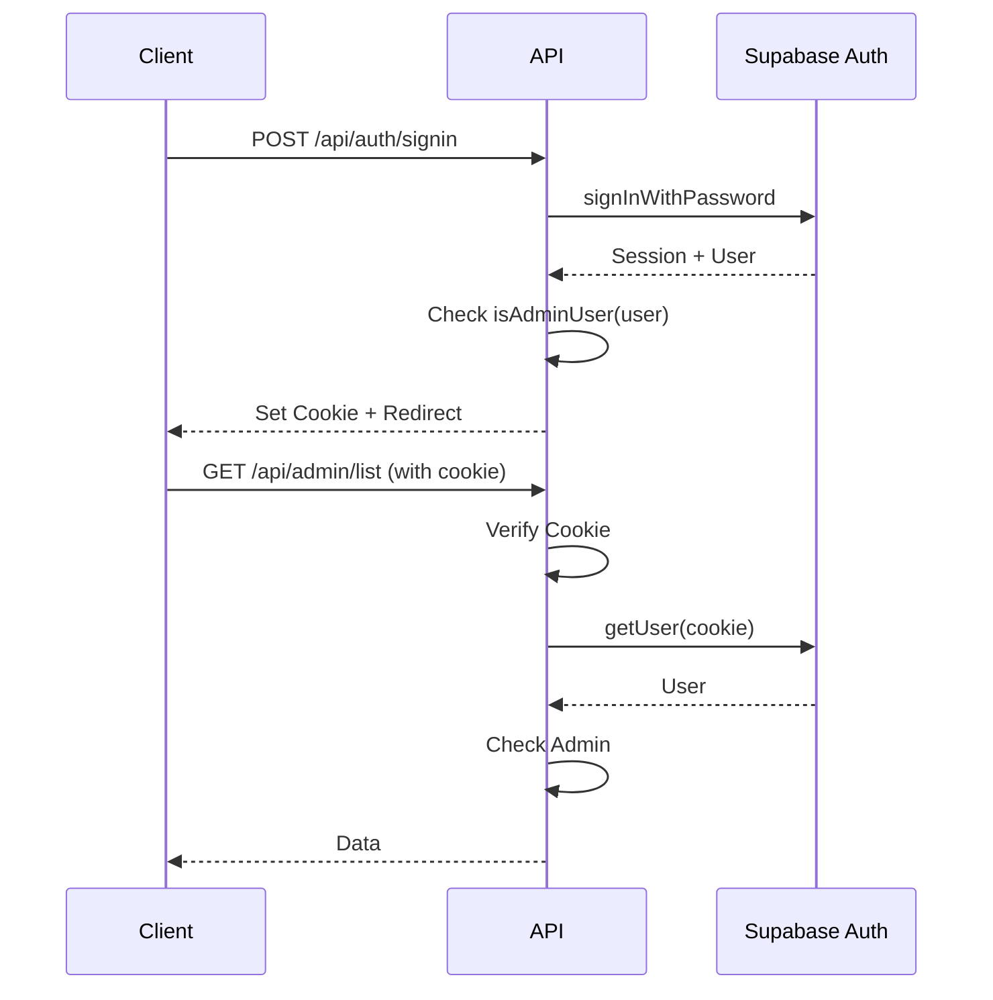

# API Documentation

Complete API reference for the SDBA Admin System.

## 📋 Table of Contents

- [Overview](#overview)
- [Authentication](#authentication)
- [Base URL](#base-url)
- [Endpoints](#endpoints)
- [Error Handling](#error-handling)
- [Rate Limiting](#rate-limiting)
- [Examples](#examples)
- [Interactive Documentation](#interactive-documentation)

## 🎯 Overview

The SDBA Admin System provides a RESTful API for managing team registrations, approvals, and exports. All endpoints return JSON responses (except CSV exports).

### API Versioning

Currently, all endpoints are under `/api/*`. Future versions will use `/api/v1/*`, `/api/v2/*`, etc.

### Content Types

- **Request**: `application/json` (for POST/PUT requests)
- **Response**: `application/json` (except CSV exports which return `text/csv`)

## 🔐 Authentication

### Admin Endpoints

Admin endpoints require:

1. **Session Cookie**: Supabase session cookie (`sb-access-token`) set automatically on login
2. **CSRF Token** (for POST/PUT/DELETE/PATCH): Include `X-CSRF-Token` header

### Getting a CSRF Token

```bash
GET /api/csrf-token
```

**Response:**
```json
{
  "ok": true,
  "token": "abc123.def456"
}
```

The token is also set in a cookie (`__Host-csrf-token`).

### Authentication Flow



## 🌐 Base URL

- **Development**: `http://localhost:3000`
- **Production**: `https://your-domain.com`

## 📡 Endpoints

### Public Endpoints

#### Register Team

```http
POST /api/public/register
```

**Description**: Submit a new team registration. No authentication required.

**Request Body:**
```json
{
  "race_category": "men_open",
  "num_teams": 2,
  "num_teams_opt1": 1,
  "num_teams_opt2": 0,
  "season": 2025,
  "org_name": "Example Organization",
  "org_address": "123 Main St",
  "team_names": ["Team Alpha", "Team Beta"],
  "team_options": ["Option 1", "Option 2"],
  "managers": {
    "manager1_name": "John Doe",
    "manager1_mobile": "1234567890",
    "manager1_email": "john@example.com",
    "manager2_name": "Jane Smith",
    "manager2_mobile": "0987654321",
    "manager2_email": "jane@example.com"
  }
}
```

**Response** (201 Created):
```json
{
  "registration_id": "550e8400-e29b-41d4-a716-446655440000",
  "teams": [
    {
      "id": "660e8400-e29b-41d4-a716-446655440001",
      "team_code": "S25-M001"
    },
    {
      "id": "660e8400-e29b-41d4-a716-446655440002",
      "team_code": "S25-M002"
    }
  ]
}
```

### Admin Endpoints

#### List Registrations

```http
GET /api/admin/list
```

**Description**: Get a paginated list of registrations with filtering and search.

**Query Parameters:**
- `page` (number, default: 1): Page number (1-indexed)
- `pageSize` (number, default: 50, max: 100): Items per page
- `q` (string, optional): Search term (searches team_name, org_name, email_1, team_code)
- `status` (string, default: "all"): Filter by status (`pending`, `approved`, `rejected`, `all`)
- `event` (string, default: "all"): Filter by event type (`tn`, `wu`, `sc`, `all`)
- `season` (number, optional): Filter by season (year, 2000-2100)

**Response** (200 OK):
```json
{
  "ok": true,
  "page": 1,
  "pageSize": 50,
  "total": 100,
  "items": [
    {
      "id": "550e8400-e29b-41d4-a716-446655440000",
      "season": 2025,
      "event_type": "tn",
      "division_code": "M",
      "category": "men_open",
      "option_choice": "Option 1",
      "team_code": "S25-M001",
      "team_name": "Team Alpha",
      "org_name": "Example Org",
      "status": "pending",
      "created_at": "2025-01-01T00:00:00Z"
    }
  ]
}
```

#### Get Counters

```http
GET /api/admin/counters
```

**Description**: Get registration statistics.

**Response** (200 OK):
```json
{
  "ok": true,
  "total": 150,
  "pending": 25,
  "approved": 100,
  "rejected": 25,
  "new_today": 5
}
```

#### Approve Registration

```http
POST /api/admin/approve
```

**Description**: Approve a pending registration.

**Headers:**
- `X-CSRF-Token`: CSRF token (required)
- `Cookie`: Session cookie (required)

**Request Body:**
```json
{
  "registration_id": "550e8400-e29b-41d4-a716-446655440000",
  "notes": "Approved after review"
}
```

**Response** (200 OK):
```json
{
  "ok": true,
  "team_meta_id": "660e8400-e29b-41d4-a716-446655440001"
}
```

**Error Responses:**
- `409 Conflict`: Registration already processed or not found
- `403 Forbidden`: Not authenticated or not admin
- `422 Validation Error`: Invalid request body

#### Reject Registration

```http
POST /api/admin/reject
```

**Description**: Reject a pending registration. Notes are required.

**Headers:**
- `X-CSRF-Token`: CSRF token (required)
- `Cookie`: Session cookie (required)

**Request Body:**
```json
{
  "registration_id": "550e8400-e29b-41d4-a716-446655440000",
  "notes": "Incomplete information provided"
}
```

**Response** (200 OK):
```json
{
  "ok": true
}
```

**Error Responses:**
- `409 Conflict`: Registration already processed or not found
- `403 Forbidden`: Not authenticated or not admin
- `422 Validation Error`: Invalid request body or missing notes

#### Export Data

```http
POST /api/admin/export
```

**Description**: Export team data as CSV file.

**Headers:**
- `X-CSRF-Token`: CSRF token (required)
- `Cookie`: Session cookie (required)

**Request Body:**
```json
{
  "mode": "tn",
  "season": 2025,
  "category": "men_open"
}
```

**Parameters:**
- `mode` (required): Export mode (`tn`, `wu`, `sc`, `all`)
- `season` (optional): Filter by season (2000-2100)
- `category` (optional, only for TN mode): Category (`men_open`, `ladies_open`, `mixed_open`, `mixed_corporate`)

**Response** (200 OK):
- **Content-Type**: `text/csv; charset=utf-8`
- **Content-Disposition**: `attachment; filename="SDBA_tn_men_open_2025-01-01T12-00.csv"`
- **Body**: CSV file with UTF-8 BOM for Excel compatibility

**Error Responses:**
- `404 Not Found`: No data found
- `400 Bad Request`: Invalid mode or parameters
- `403 Forbidden`: Not authenticated or not admin

### Auth Endpoints

#### Sign In

```http
POST /api/auth/signin
```

**Description**: Sign in with email and password.

**Request Body:**
```json
{
  "email": "admin@example.com",
  "password": "password"
}
```

**Response** (200 OK):
```json
{
  "ok": true,
  "message": "Login successful"
}
```

Sets session cookie automatically.

#### Sign Up

```http
POST /api/auth/signup
```

**Description**: Create a new admin user (requires service role key).

**Request Body:**
```json
{
  "email": "admin@example.com",
  "password": "password"
}
```

**Response** (201 Created):
```json
{
  "ok": true,
  "message": "User created successfully"
}
```

## ⚠️ Error Handling

All errors follow a consistent format:

```json
{
  "ok": false,
  "error": "Error message",
  "code": "ERROR_CODE"
}
```

### Error Codes

| Code | Status | Description |
|------|--------|-------------|
| `BAD_REQUEST` | 400 | Invalid request parameters |
| `FORBIDDEN` | 403 | Authentication required or insufficient permissions |
| `NOT_FOUND` | 404 | Resource not found |
| `CONFLICT` | 409 | Resource conflict (e.g., already processed) |
| `VALIDATION_ERROR` | 422 | Request validation failed |
| `CSRF_ERROR` | 403 | CSRF token validation failed |
| `RATE_LIMIT_EXCEEDED` | 429 | Rate limit exceeded |
| `INTERNAL_ERROR` | 500 | Internal server error |

### Validation Errors

Validation errors include a `detail` array:

```json
{
  "ok": false,
  "error": "Validation failed",
  "code": "VALIDATION_ERROR",
  "detail": [
    {
      "path": ["registration_id"],
      "message": "Invalid uuid"
    }
  ]
}
```

## 🚦 Rate Limiting

### Limits

- **Public API**: 10 requests per 10 seconds per IP
- **Admin API**: 100 requests per minute per authenticated user

### Rate Limit Headers

All responses include rate limit headers:

```
X-RateLimit-Limit: 100
X-RateLimit-Remaining: 95
X-RateLimit-Reset: 1640995200
```

### Rate Limit Exceeded

When rate limit is exceeded, returns `429 Too Many Requests`:

```json
{
  "ok": false,
  "error": "Rate limit exceeded",
  "code": "RATE_LIMIT_EXCEEDED"
}
```

## 💡 Examples

### cURL Examples

**Get CSRF Token:**
```bash
curl -X GET http://localhost:3000/api/csrf-token \
  -c cookies.txt
```

**List Registrations:**
```bash
curl -X GET "http://localhost:3000/api/admin/list?page=1&pageSize=50&status=pending" \
  -b cookies.txt
```

**Approve Registration:**
```bash
# Get CSRF token first
CSRF_TOKEN=$(curl -s -X GET http://localhost:3000/api/csrf-token -c cookies.txt | jq -r '.token')

curl -X POST http://localhost:3000/api/admin/approve \
  -H "Content-Type: application/json" \
  -H "X-CSRF-Token: $CSRF_TOKEN" \
  -b cookies.txt \
  -d '{
    "registration_id": "550e8400-e29b-41d4-a716-446655440000",
    "notes": "Approved"
  }'
```

### JavaScript/TypeScript Examples

**Using Fetch API:**
```typescript
// Get CSRF token
const csrfResponse = await fetch('/api/csrf-token');
const { token } = await csrfResponse.json();

// Approve registration
const response = await fetch('/api/admin/approve', {
  method: 'POST',
  headers: {
    'Content-Type': 'application/json',
    'X-CSRF-Token': token,
  },
  credentials: 'include', // Include cookies
  body: JSON.stringify({
    registration_id: '550e8400-e29b-41d4-a716-446655440000',
    notes: 'Approved',
  }),
});

const data = await response.json();
```

**Using Axios:**
```typescript
import axios from 'axios';

// Get CSRF token
const { data: { token } } = await axios.get('/api/csrf-token');

// Approve registration
const { data } = await axios.post(
  '/api/admin/approve',
  {
    registration_id: '550e8400-e29b-41d4-a716-446655440000',
    notes: 'Approved',
  },
  {
    headers: {
      'X-CSRF-Token': token,
    },
    withCredentials: true, // Include cookies
  }
);
```

## 📚 Interactive Documentation

### Swagger UI

Access interactive API documentation at `/api-docs` (admin-only):

1. Start development server: `npm run dev`
2. Log in as admin user
3. Navigate to `http://localhost:3000/api-docs`
4. Use "Try it out" to test endpoints

### Postman Collection

Import the Postman collection for easy API testing:

1. Open Postman
2. Click "Import"
3. Select `docs/postman-collection.json`
4. Import `docs/postman-environment.json` as environment
5. Set `baseUrl` variable to your API URL

### OpenAPI Specification

The complete OpenAPI 3.0 specification is available at:
- **File**: `docs/openapi.yaml`
- **Served at**: `/docs/openapi.yaml`

You can view it using:
- [Swagger Editor](https://editor.swagger.io/)
- [Redoc](https://redocly.github.io/redoc/)
- Any OpenAPI-compatible tool

## 🔗 Related Documentation

- [API_DOCUMENTATION.md](./docs/API_DOCUMENTATION.md) - API documentation setup guide
- [README.md](./README.md) - Project overview
- [ARCHITECTURE.md](./ARCHITECTURE.md) - System architecture

---

**Last Updated**: 2025-01-01

