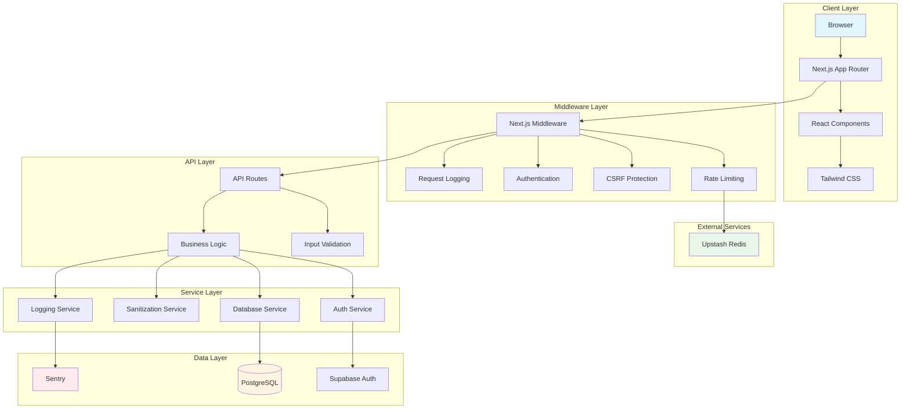
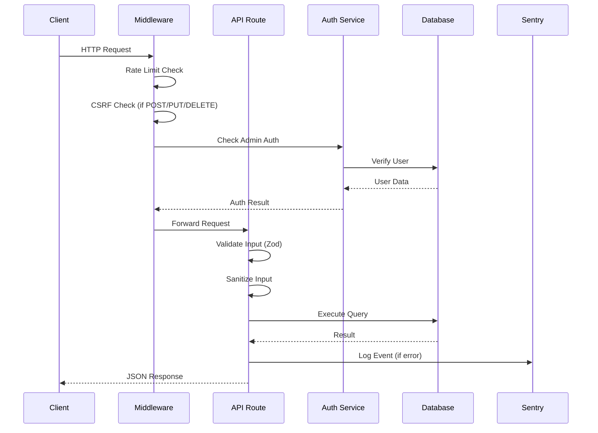
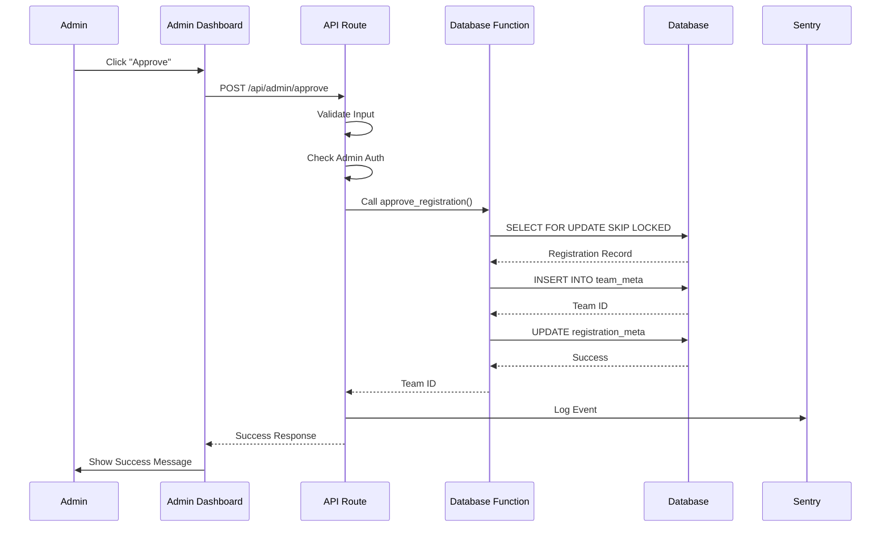
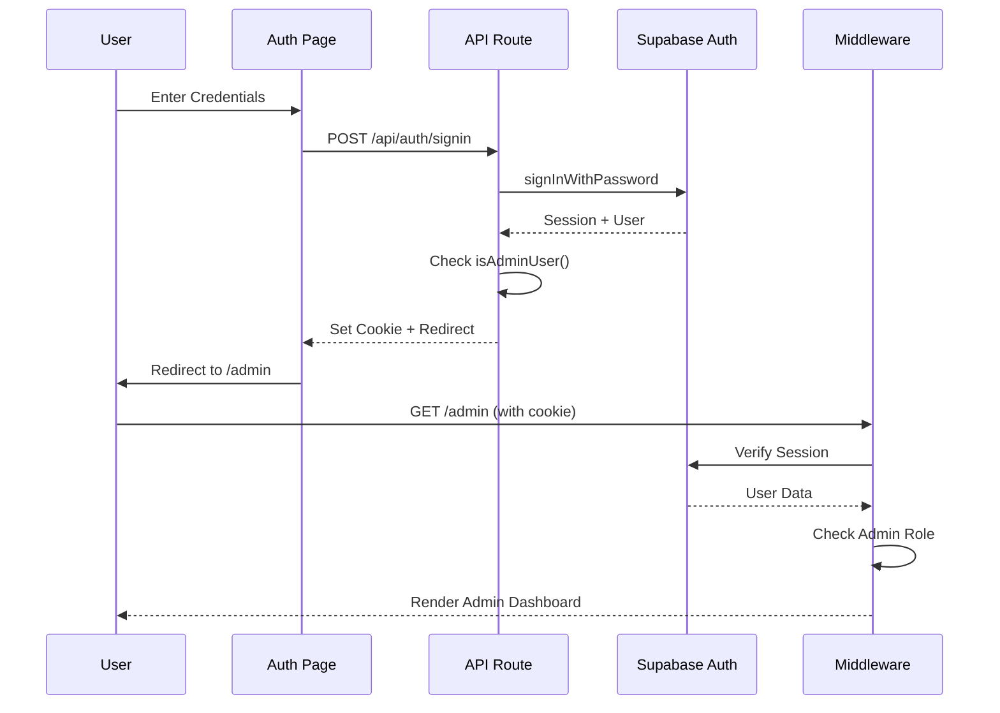
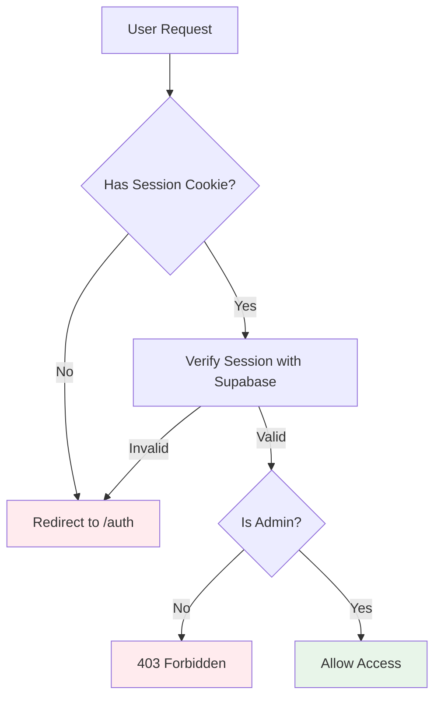

# Architecture Documentation

This document describes the architecture, design decisions, and technical details of the SDBA Admin System.

## 📋 Table of Contents

- [Overview](#overview)
- [System Architecture](#system-architecture)
- [Technology Stack](#technology-stack)
- [Application Structure](#application-structure)
- [Data Flow](#data-flow)
- [Security Architecture](#security-architecture)
- [Performance Considerations](#performance-considerations)
- [Scalability](#scalability)

## 🎯 Overview

The SDBA Admin System is built as a modern, serverless-first web application using Next.js 16 with the App Router. It follows a layered architecture pattern with clear separation of concerns:

- **Presentation Layer**: React components and pages
- **API Layer**: Next.js API routes with middleware
- **Business Logic Layer**: Utility functions and services
- **Data Layer**: Supabase (PostgreSQL + Auth)

## 🏗 System Architecture

### High-Level Architecture



### Request Flow



## 🛠 Technology Stack

### Frontend

- **Next.js 16**: React framework with App Router
- **React 19**: UI library
- **TypeScript 5.9**: Type-safe JavaScript
- **Tailwind CSS 3.4**: Utility-first CSS framework

### Backend

- **Next.js API Routes**: Serverless API endpoints
- **Supabase**: Backend-as-a-Service
  - PostgreSQL database
  - Authentication
  - Row-Level Security (RLS)

### Infrastructure

- **Vercel**: Hosting and deployment
- **Upstash Redis**: Rate limiting storage
- **Sentry**: Error monitoring and performance tracking

### Development Tools

- **Jest**: Testing framework
- **React Testing Library**: Component testing
- **ESLint**: Code linting
- **OpenAPI**: API documentation

## 📁 Application Structure

### Directory Organization

```
app/                    # Next.js App Router
├── admin/             # Admin dashboard pages
├── api/               # API routes
│   ├── admin/        # Admin-only endpoints
│   ├── auth/         # Authentication endpoints
│   └── public/       # Public endpoints
├── auth/              # Authentication pages
└── api-docs/          # API documentation page

lib/                   # Utility libraries
├── auth.ts           # Authentication utilities
├── api-errors.ts     # Error handling
├── sanitize.ts       # Input sanitization
├── csrf.ts           # CSRF protection
├── ratelimit.ts      # Rate limiting
├── db-utils.ts       # Database utilities
└── logger.ts         # Logging

components/            # Reusable React components
types/                 # TypeScript type definitions
db_schema/             # Database schema
docs/                  # Documentation
```

### Layer Responsibilities

#### Presentation Layer (`app/`, `components/`)

- **Pages**: Route handlers and page components
- **Components**: Reusable UI components
- **Styling**: Tailwind CSS classes

**Responsibilities:**
- User interface rendering
- User interaction handling
- Client-side state management
- Form validation (client-side)

#### API Layer (`app/api/`)

- **Route Handlers**: HTTP request handlers
- **Middleware**: Request processing (rate limiting, CSRF, auth)

**Responsibilities:**
- Request/response handling
- Input validation
- Authentication/authorization
- Error handling

#### Business Logic Layer (`lib/`)

- **Services**: Business logic and utilities
- **Validators**: Input validation schemas
- **Helpers**: Utility functions

**Responsibilities:**
- Business logic implementation
- Data transformation
- Validation rules
- Error handling logic

#### Data Layer (`lib/supabase*.ts`, `db_schema/`)

- **Database Client**: Supabase client configuration
- **Schema**: Database schema and migrations
- **Queries**: Database query utilities

**Responsibilities:**
- Database access
- Query execution
- Data persistence
- Transaction management

## 🔄 Data Flow

### Registration Approval Flow



### Authentication Flow



## 🔒 Security Architecture

### Security Layers

1. **Network Layer**: HTTPS/TLS encryption
2. **Application Layer**: 
   - CSRF protection
   - Rate limiting
   - Input sanitization
   - Authentication/authorization
3. **Database Layer**: 
   - Row-Level Security (RLS)
   - Parameterized queries
   - Connection pooling

### Authentication & Authorization



### CSRF Protection

- **Double-Submit Cookie Pattern**: Token in both cookie and header
- **HMAC-SHA256 Signing**: Cryptographically signed tokens
- **Timing-Safe Comparison**: Prevents timing attacks
- **Secure Cookies**: `__Host-` prefix, `httpOnly`, `secure`, `sameSite=strict`

### Rate Limiting

- **Public API**: 10 requests per 10 seconds per IP
- **Admin API**: 100 requests per minute per user
- **Storage**: Upstash Redis (production) or in-memory (development)
- **Headers**: `X-RateLimit-*` headers in responses

## ⚡ Performance Considerations

### Database Optimization

- **Indexes**: Strategic indexes on frequently queried columns
- **Query Optimization**: Cursor-based pagination, query hints
- **Connection Pooling**: Supabase handles connection pooling
- **Query Caching**: In-memory caching for development

### Frontend Optimization

- **Code Splitting**: Automatic with Next.js App Router
- **Image Optimization**: Next.js Image component
- **Static Generation**: Where applicable
- **Client-Side Caching**: React Query or SWR (if added)

### API Optimization

- **Request Logging**: Minimal overhead, async logging
- **Error Handling**: Fast-fail on validation errors
- **Response Compression**: Automatic with Vercel
- **CDN**: Automatic with Vercel Edge Network

## 📈 Scalability

### Horizontal Scaling

- **Stateless API**: All API routes are stateless
- **Serverless**: Automatic scaling with Vercel
- **Database**: Supabase handles database scaling
- **Redis**: Upstash Redis scales automatically

### Vertical Scaling

- **Database Indexes**: Optimize query performance
- **Query Optimization**: Reduce database load
- **Caching**: Reduce redundant queries
- **Connection Pooling**: Efficient database connections

### Future Considerations

- **Read Replicas**: For read-heavy workloads
- **Caching Layer**: Redis for frequently accessed data
- **CDN**: For static assets
- **Database Sharding**: If data grows significantly

## 🔍 Monitoring & Observability

### Logging

- **Request Logging**: All requests logged with correlation IDs
- **Error Logging**: Errors logged to Sentry
- **Performance Logging**: Slow queries logged
- **Structured Logging**: JSON format for production

### Error Tracking

- **Sentry Integration**: Automatic error capture
- **Error Categorization**: Network, Auth, Validation, Server
- **User Context**: User ID, email, role attached to errors
- **Performance Monitoring**: Transaction tracing

### Metrics

- **Request Metrics**: Count, duration, status codes
- **Database Metrics**: Query count, duration, errors
- **Error Metrics**: Error rate, error types
- **Performance Metrics**: P50, P95, P99 latencies

## 🧩 Design Patterns

### Used Patterns

1. **Middleware Pattern**: Request processing pipeline
2. **Service Layer Pattern**: Business logic separation
3. **Repository Pattern**: Database access abstraction (via Supabase)
4. **Factory Pattern**: Client creation (Supabase clients)
5. **Strategy Pattern**: Different rate limiters (Redis vs in-memory)

### Best Practices

- **DRY (Don't Repeat Yourself)**: Shared utilities in `lib/`
- **Single Responsibility**: Each function/component has one job
- **Fail Fast**: Early validation and error handling
- **Type Safety**: TypeScript strict mode
- **Error Handling**: Consistent error responses

## 📚 Additional Resources

- [Next.js Documentation](https://nextjs.org/docs)
- [Supabase Documentation](https://supabase.com/docs)
- [TypeScript Handbook](https://www.typescriptlang.org/docs/)
- [React Documentation](https://react.dev/)

---

**Last Updated**: 2025-01-01

