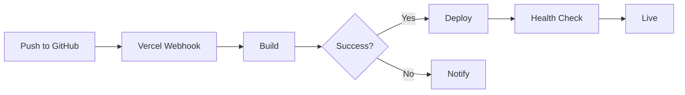

# Deployment Guide

Complete guide for deploying the SDBA Admin System to production.

## 📋 Table of Contents

- [Prerequisites](#prerequisites)
- [Vercel Deployment](#vercel-deployment)
- [Environment Variables](#environment-variables)
- [Database Setup](#database-setup)
- [Post-Deployment Verification](#post-deployment-verification)
- [Monitoring](#monitoring)
- [Troubleshooting](#troubleshooting)

## ✅ Prerequisites

Before deploying, ensure you have:

- ✅ **Supabase Project**: Active Supabase project with database
- ✅ **Vercel Account**: [Sign up here](https://vercel.com)
- ✅ **GitHub Repository**: Code pushed to GitHub
- ✅ **Environment Variables**: All required variables ready
- ✅ **Domain** (optional): Custom domain for production

## 🚀 Vercel Deployment

### Step 1: Push Code to GitHub

```bash
# Ensure all changes are committed
git add .
git commit -m "chore: prepare for deployment"
git push origin main
```

### Step 2: Import Project in Vercel

1. Go to [Vercel Dashboard](https://vercel.com/dashboard)
2. Click **"Add New Project"**
3. Select your GitHub repository
4. Click **"Import"**

### Step 3: Configure Project Settings

**Framework Preset**: Next.js (auto-detected)

**Build Settings**:
- **Build Command**: `npm run build` (default)
- **Output Directory**: `.next` (default)
- **Install Command**: `npm install` (default)

**Root Directory**: Leave empty (or set if project is in subdirectory)

### Step 4: Set Environment Variables

In Vercel project settings → **Environment Variables**, add:

#### Required Variables

```env
NEXT_PUBLIC_SUPABASE_URL=https://your-project.supabase.co
NEXT_PUBLIC_SUPABASE_ANON_KEY=your-anon-key
SUPABASE_SERVICE_ROLE_KEY=your-service-role-key
CSRF_SECRET=your-random-secret-here
```

#### Optional Variables

```env
# Rate Limiting (Production)
UPSTASH_REDIS_REST_URL=https://your-redis.upstash.io
UPSTASH_REDIS_REST_TOKEN=your-redis-token

# Sentry Error Monitoring
SENTRY_DSN=https://your-sentry-dsn@sentry.io/project-id
NEXT_PUBLIC_SENTRY_DSN=https://your-sentry-dsn@sentry.io/project-id
SENTRY_AUTH_TOKEN=your-sentry-auth-token
SENTRY_ORG=your-sentry-org-slug
SENTRY_PROJECT=your-sentry-project-slug

# Node Environment
NODE_ENV=production
```

**Important**: 
- Set variables for **Production**, **Preview**, and **Development** environments
- Use different `CSRF_SECRET` for each environment
- Never commit secrets to version control

### Step 5: Deploy

1. Click **"Deploy"**
2. Wait for build to complete
3. Vercel will provide a deployment URL (e.g., `https://your-project.vercel.app`)

### Step 6: Configure Custom Domain (Optional)

1. Go to **Settings** → **Domains**
2. Add your custom domain
3. Follow DNS configuration instructions
4. Wait for DNS propagation (may take up to 48 hours)

## 🔐 Environment Variables

### Getting Supabase Credentials

1. Go to [Supabase Dashboard](https://app.supabase.com)
2. Select your project
3. Navigate to **Settings** → **API**
4. Copy:
   - **Project URL** → `NEXT_PUBLIC_SUPABASE_URL`
   - **anon public** key → `NEXT_PUBLIC_SUPABASE_ANON_KEY`
   - **service_role secret** key → `SUPABASE_SERVICE_ROLE_KEY`

### Generating CSRF Secret

Generate a strong random secret:

```bash
# Using OpenSSL
openssl rand -hex 32

# Using Node.js
node -e "console.log(require('crypto').randomBytes(32).toString('hex'))"
```

### Setting Up Upstash Redis (Optional)

1. Go to [Upstash Console](https://console.upstash.com)
2. Create a new Redis database
3. Copy:
   - **REST URL** → `UPSTASH_REDIS_REST_URL`
   - **REST Token** → `UPSTASH_REDIS_REST_TOKEN`

### Setting Up Sentry (Optional)

1. Go to [Sentry Dashboard](https://sentry.io)
2. Create a new project (choose Next.js)
3. Get DSN from **Settings** → **Client Keys (DSN)**
4. Create Auth Token: **User Settings** → **API Keys** → **Create New Token**
   - Scopes: `project:releases`, `project:write`
5. Copy:
   - **DSN** → `SENTRY_DSN` and `NEXT_PUBLIC_SENTRY_DSN`
   - **Auth Token** → `SENTRY_AUTH_TOKEN`
   - **Organization Slug** → `SENTRY_ORG` (from URL)
   - **Project Slug** → `SENTRY_PROJECT` (from URL)

## 🗄 Database Setup

### Step 1: Run Main Schema

1. Go to Supabase Dashboard → **SQL Editor**
2. Open `db_schema/main.sql`
3. Copy and paste entire contents
4. Click **Run**

This creates:
- All tables (`registration_meta`, `team_meta`, etc.)
- Database functions (`approve_registration`, `reject_registration`)
- Views for different event types
- Row-Level Security (RLS) policies

### Step 2: Run Migrations

Run migrations in order:

1. **003_add_reject_locking.sql**
   - Adds row-level locking to `reject_registration` function
   - Ensures consistency with `approve_registration`

2. **004_add_indexes.sql**
   - Adds performance indexes
   - Optimizes common query patterns

**To run migrations:**
1. Go to Supabase Dashboard → **SQL Editor**
2. Open migration file
3. Copy and paste contents
4. Click **Run**

### Step 3: Verify Database Setup

Run verification queries:

```sql
-- Check tables exist
SELECT table_name 
FROM information_schema.tables 
WHERE table_schema = 'public';

-- Check functions exist
SELECT routine_name 
FROM information_schema.routines 
WHERE routine_schema = 'public';

-- Check indexes exist
SELECT indexname 
FROM pg_indexes 
WHERE schemaname = 'public';
```

### Step 4: Create Admin User

**Option A: Via API** (Recommended)

```bash
curl -X POST https://your-domain.com/api/auth/signup \
  -H "Content-Type: application/json" \
  -d '{
    "email": "admin@example.com",
    "password": "secure-password"
  }'
```

**Option B: Via Supabase Dashboard**

1. Go to **Authentication** → **Users**
2. Click **Add user** → **Create new user**
3. Set email and password
4. In **User Metadata**, add:
   ```json
   {
     "role": "admin"
   }
   ```

## ✅ Post-Deployment Verification

### 1. Health Check

Visit your deployment URL:
```
https://your-domain.com
```

Should redirect to `/auth` if not logged in.

### 2. Test Authentication

1. Navigate to `/auth`
2. Log in with admin credentials
3. Should redirect to `/admin` dashboard

### 3. Test API Endpoints

**Get CSRF Token:**
```bash
curl -X GET https://your-domain.com/api/csrf-token
```

**List Registrations** (requires auth):
```bash
curl -X GET "https://your-domain.com/api/admin/list?page=1&pageSize=10" \
  -H "Cookie: sb-access-token=your-session-token"
```

### 4. Test Admin Dashboard

1. Log in as admin
2. Navigate to `/admin`
3. Verify:
   - Dashboard loads
   - Counters display correctly
   - Applications list works
   - Export functionality works

### 5. Check Logs

**Vercel Logs:**
1. Go to Vercel Dashboard → Your Project
2. Click **Deployments** → Select deployment
3. Click **Functions** tab to view logs

**Sentry** (if configured):
1. Go to Sentry Dashboard
2. Check for errors and performance issues

### 6. Verify Environment Variables

Check that all environment variables are set correctly in Vercel:
1. Go to **Settings** → **Environment Variables**
2. Verify all required variables are present
3. Check that values are correct (without exposing secrets)

## 📊 Monitoring

### Vercel Analytics

Enable Vercel Analytics for:
- Page views
- Performance metrics
- Web Vitals

### Sentry Monitoring

If Sentry is configured:
- **Errors**: Automatic error capture
- **Performance**: Transaction tracing
- **Releases**: Track deployments
- **Alerts**: Set up alert rules

### Database Monitoring

Monitor Supabase:
- **Database**: Query performance, connection pool
- **Auth**: User activity, session management
- **Storage**: Database size, backups

### Logs

**Vercel Logs:**
- Real-time logs in Vercel Dashboard
- Function logs for API routes
- Build logs for deployments

**Application Logs:**
- Request/response logs (if configured)
- Error logs (via Sentry)
- Performance logs (via Sentry)

## 🔧 Troubleshooting

### Build Failures

**Issue**: Build fails with environment variable errors

**Solution**:
1. Check all required environment variables are set in Vercel
2. Verify variable names match exactly (case-sensitive)
3. Check for typos in variable values

**Issue**: Build fails with TypeScript errors

**Solution**:
1. Run `npm run build` locally to catch errors
2. Fix TypeScript errors
3. Ensure all types are properly defined

### Runtime Errors

**Issue**: "Missing required environment variables"

**Solution**:
1. Verify environment variables in Vercel settings
2. Redeploy after adding variables
3. Check variable names match `lib/env.ts`

**Issue**: Database connection errors

**Solution**:
1. Verify Supabase project is active
2. Check database URL and keys are correct
3. Ensure RLS policies are configured
4. Check Supabase service status

**Issue**: Authentication not working

**Solution**:
1. Verify Supabase Auth is enabled
2. Check session cookies are being set
3. Verify admin user has correct metadata
4. Check CORS settings in Supabase

### Performance Issues

**Issue**: Slow API responses

**Solution**:
1. Check database indexes are created
2. Monitor database query performance
3. Enable Upstash Redis for rate limiting
4. Check Vercel function logs for slow queries

**Issue**: High database costs

**Solution**:
1. Optimize queries (use indexes)
2. Implement caching where appropriate
3. Monitor query patterns
4. Consider read replicas for read-heavy workloads

### Deployment Issues

**Issue**: Deployment succeeds but site doesn't load

**Solution**:
1. Check Vercel deployment logs
2. Verify build output is correct
3. Check for runtime errors in function logs
4. Verify environment variables are set

**Issue**: Changes not reflecting after deployment

**Solution**:
1. Clear browser cache
2. Check deployment actually succeeded
3. Verify code was pushed to correct branch
4. Check for caching issues (CDN, browser)

## 🔄 Continuous Deployment

Vercel automatically deploys on every push to:
- **Production**: `main` branch
- **Preview**: All other branches and pull requests

### Deployment Workflow



### Manual Deployment

To manually trigger deployment:
1. Go to Vercel Dashboard
2. Click **Deployments**
3. Click **Redeploy** on latest deployment

## 📚 Additional Resources

- [Vercel Documentation](https://vercel.com/docs)
- [Supabase Documentation](https://supabase.com/docs)
- [Next.js Deployment](https://nextjs.org/docs/deployment)
- [Environment Variables Best Practices](https://vercel.com/docs/concepts/projects/environment-variables)

---

**Last Updated**: 2025-01-01

