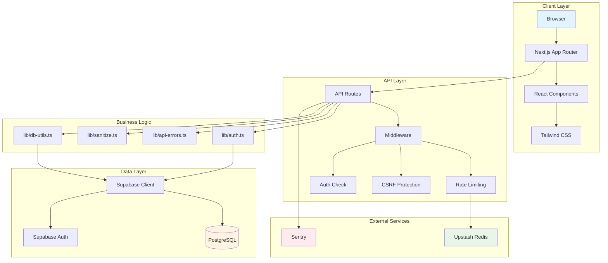
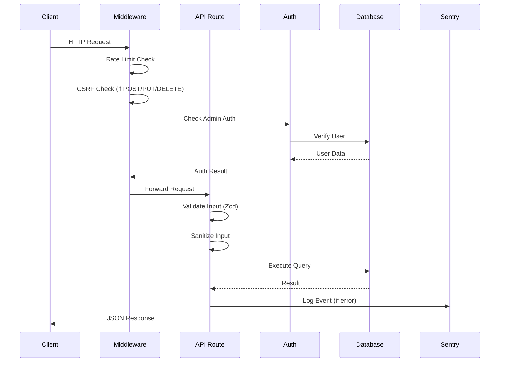
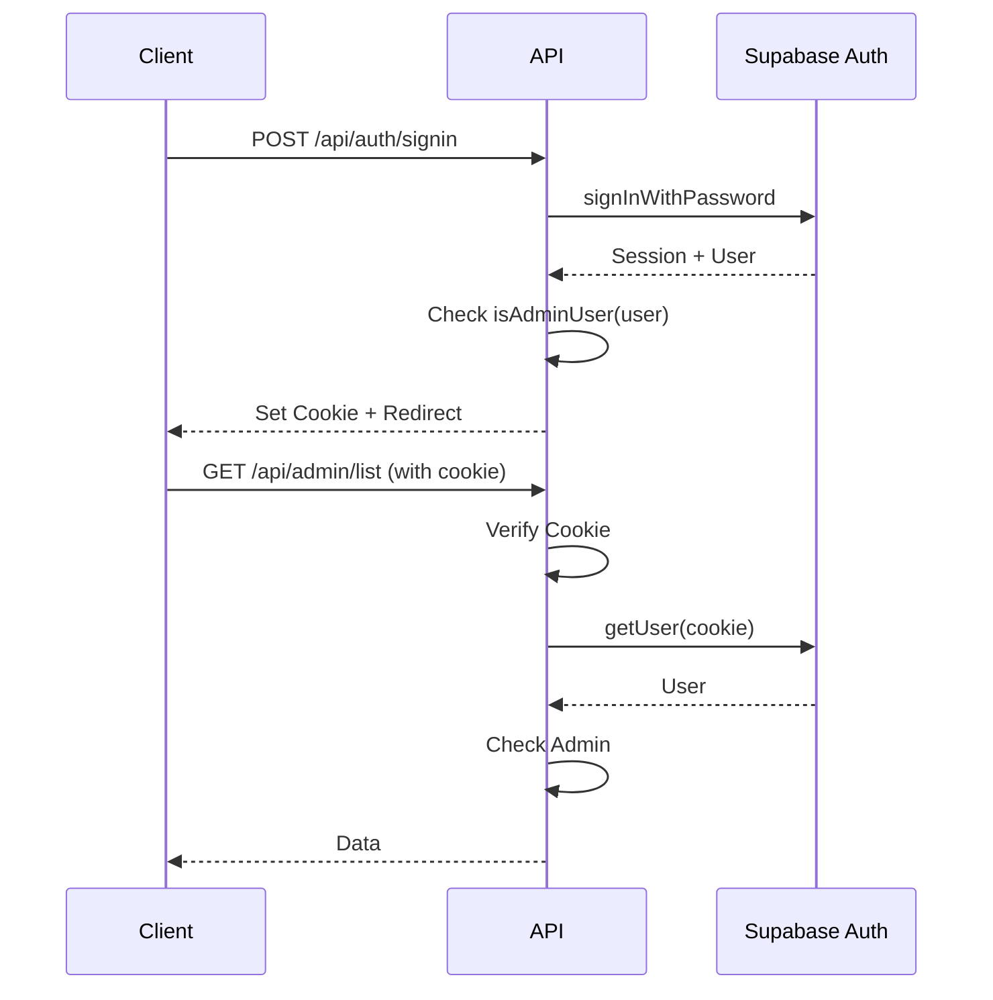

# SDBA Admin System

<div align="center">


**A comprehensive admin dashboard for managing SDBA (Sports Database Administration) team registrations, approvals, and exports.**

[Features](#-features) • [Getting Started](#-getting-started) • [Documentation](#-documentation) • [API Docs](#-api-documentation) • [Contributing](#-contributing)

</div>

---

## 📋 Table of Contents

- [Overview](#-overview)
- [Features](#-features)
- [Technology Stack](#-technology-stack)
- [Architecture](#-architecture)
- [Getting Started](#-getting-started)
- [Project Structure](#-project-structure)
- [Development Guide](#-development-guide)
- [API Documentation](#-api-documentation)
- [Deployment](#-deployment)
- [Testing](#-testing)
- [Troubleshooting](#-troubleshooting)
- [Contributing](#-contributing)
- [Security](#-security)
- [License](#-license)

---

## 🎯 Overview

The SDBA Admin System is a modern, secure, and scalable admin dashboard built with Next.js 16 and Supabase. It provides administrators with powerful tools to manage team registrations, review applications, approve or reject submissions, and export data for various sports events (TN, WU, SC).

### Key Capabilities

- **Registration Management**: Review, approve, or reject team registrations with detailed notes
- **Real-time Dashboard**: Live statistics and KPIs for pending, approved, and rejected registrations
- **Data Export**: Export team data as CSV files for different event types and categories
- **Secure Authentication**: Role-based access control with Supabase Auth
- **Performance Optimized**: Database indexes, query optimization, and caching strategies
- **Comprehensive Logging**: Request/response logging, error tracking with Sentry
- **API Documentation**: Interactive Swagger UI with "Try it out" functionality

---

## ✨ Features

### 🔐 Security
- ✅ **CSRF Protection** - Double-submit cookie pattern for state-changing requests
- ✅ **Rate Limiting** - IP-based and user-based rate limiting (Upstash Redis)
- ✅ **Input Sanitization** - XSS prevention with DOMPurify
- ✅ **Row-Level Security** - Database-level access control with Supabase RLS
- ✅ **Secure Cookies** - HttpOnly, Secure, SameSite cookies
- ✅ **Error Monitoring** - Sentry integration for production error tracking

### 📊 Admin Dashboard
- ✅ **Real-time Statistics** - Live counters for total, pending, approved, rejected registrations
- ✅ **Advanced Filtering** - Filter by status, event type, season, and search terms
- ✅ **Pagination** - Efficient cursor-based pagination for large datasets
- ✅ **Bulk Operations** - Approve/reject multiple registrations
- ✅ **Export Functionality** - CSV exports with UTF-8 BOM for Excel compatibility

### 🚀 Performance
- ✅ **Database Indexing** - Optimized indexes for common query patterns
- ✅ **Query Optimization** - Cursor-based pagination, query hints, performance monitoring
- ✅ **Caching** - In-memory caching for development (configurable for production)
- ✅ **Request Logging** - Comprehensive request/response logging with correlation IDs

### 🧪 Testing
- ✅ **Unit Tests** - Jest with React Testing Library
- ✅ **Integration Tests** - API route testing with mocked dependencies
- ✅ **Code Coverage** - Target 80%+ coverage for critical paths
- ✅ **Type Safety** - Full TypeScript coverage with strict mode

### 📚 Documentation
- ✅ **OpenAPI Specification** - Complete API documentation in OpenAPI 3.0 format
- ✅ **Interactive Swagger UI** - Admin-only API documentation page
- ✅ **Postman Collection** - Ready-to-use Postman collection for API testing
- ✅ **TypeScript Types** - Auto-generated types from OpenAPI spec

---

## 🛠 Technology Stack

### Core Framework
- **Next.js** `16.0.8` - React framework with App Router
- **React** `19.1.0` - UI library
- **TypeScript** `5.9.3` - Type-safe JavaScript

### Backend & Database
- **Supabase** `2.58.0` - Backend-as-a-Service
  - PostgreSQL database
  - Authentication (Supabase Auth)
  - Row-Level Security (RLS)
- **@supabase/ssr** `0.7.0` - Server-side rendering support

### Styling & UI
- **Tailwind CSS** `3.4.17` - Utility-first CSS framework
- **Sonner** `2.0.7` - Toast notifications

### Validation & Security
- **Zod** `4.1.11` - Schema validation
- **isomorphic-dompurify** `2.34.0` - HTML sanitization
- **csrf** `3.1.0` - CSRF protection utilities

### Monitoring & Observability
- **@sentry/nextjs** `10.30.0` - Error monitoring and performance tracking
- **@upstash/ratelimit** `2.0.7` - Rate limiting
- **@upstash/redis** `1.35.7` - Redis client for rate limiting

### Development Tools
- **Jest** `30.2.0` - Testing framework
- **@testing-library/react** `16.3.0` - React component testing
- **ESLint** `9.0.0` - Code linting
- **openapi-typescript** `7.10.1` - Type generation from OpenAPI
- **swagger-ui-react** `5.31.0` - Interactive API documentation

---

## 🏗 Architecture

### System Architecture



### Request Flow



For detailed architecture documentation, see [ARCHITECTURE.md](./ARCHITECTURE.md).

---

## 🚀 Getting Started

### Prerequisites

- **Node.js** `18.x` or higher
- **npm** `9.x` or higher (or `yarn`/`pnpm`)
- **Supabase Account** - [Sign up here](https://supabase.com)
- **Git** - For version control

### Installation

1. **Clone the repository**

```bash
git clone <repository-url>
cd SDBA_admin_system-3
```

2. **Install dependencies**

```bash
npm install
```

3. **Set up environment variables**

Copy `.env.example` to `.env.local`:

```bash
cp .env.example .env.local
```

Edit `.env.local` with your Supabase credentials:

```env
NEXT_PUBLIC_SUPABASE_URL=https://your-project.supabase.co
NEXT_PUBLIC_SUPABASE_ANON_KEY=your-anon-key
SUPABASE_SERVICE_ROLE_KEY=your-service-role-key
CSRF_SECRET=your-random-secret-here
```

**Where to find Supabase credentials:**
1. Go to your [Supabase Dashboard](https://app.supabase.com)
2. Select your project
3. Navigate to **Settings** → **API**
4. Copy the values:
   - **Project URL** → `NEXT_PUBLIC_SUPABASE_URL`
   - **anon public** key → `NEXT_PUBLIC_SUPABASE_ANON_KEY`
   - **service_role secret** key → `SUPABASE_SERVICE_ROLE_KEY`

⚠️ **Security Warning**: Never commit `.env.local` to version control. The service role key has full database access.

4. **Set up the database**

Run the database schema in your Supabase SQL Editor:

1. Go to your Supabase project dashboard
2. Navigate to **SQL Editor**
3. Open `db_schema/main.sql`
4. Copy and paste the entire contents
5. Click **Run** to execute

This creates:
- All necessary tables (`registration_meta`, `team_meta`, etc.)
- Database functions (`approve_registration`, `reject_registration`)
- Views for different event types
- Row-Level Security (RLS) policies
- Indexes for performance optimization

5. **Run database migrations** (if any)

```bash
# Migrations are in db_schema/migrations/
# Run them in order in the Supabase SQL Editor:
# - 003_add_reject_locking.sql
# - 004_add_indexes.sql
```

6. **Create an admin user**

You can create an admin user in two ways:

**Option A: Via API** (Recommended for development)
```bash
curl -X POST http://localhost:3000/api/auth/signup \
  -H "Content-Type: application/json" \
  -d '{
    "email": "admin@example.com",
    "password": "secure-password"
  }'
```

**Option B: Via Supabase Dashboard**
1. Go to **Authentication** → **Users**
2. Click **Add user** → **Create new user**
3. Set email and password
4. In **User Metadata**, add:
   ```json
   {
     "role": "admin"
   }
   ```

7. **Start the development server**

```bash
npm run dev
```

Open [http://localhost:3000](http://localhost:3000) in your browser.

8. **Log in**

Navigate to `/auth` and log in with your admin credentials.

---

## 📁 Project Structure

```
SDBA_admin_system-3/
├── app/                          # Next.js App Router
│   ├── admin/                    # Admin dashboard pages
│   │   └── page.tsx             # Main admin dashboard
│   ├── api/                      # API routes
│   │   ├── admin/               # Admin-only endpoints
│   │   │   ├── approve/         # POST /api/admin/approve
│   │   │   ├── reject/          # POST /api/admin/reject
│   │   │   ├── list/            # GET /api/admin/list
│   │   │   ├── counters/        # GET /api/admin/counters
│   │   │   └── export/          # POST /api/admin/export
│   │   ├── auth/                # Authentication endpoints
│   │   │   ├── signin/          # POST /api/auth/signin
│   │   │   └── signup/          # POST /api/auth/signup
│   │   ├── public/              # Public endpoints
│   │   │   └── register/        # POST /api/public/register
│   │   └── csrf-token/          # GET /api/csrf-token
│   ├── api-docs/                # API documentation page
│   │   └── page.tsx             # Swagger UI (admin-only)
│   ├── auth/                    # Authentication pages
│   │   └── page.tsx             # Login page
│   └── layout.tsx               # Root layout
│
├── components/                   # Reusable React components
│   ├── ErrorBoundary.tsx        # Error boundary component
│   └── Spinner.tsx              # Loading spinner
│
├── lib/                          # Utility libraries
│   ├── auth.ts                  # Authentication utilities
│   ├── api-errors.ts            # Standardized error handling
│   ├── sanitize.ts              # Input sanitization
│   ├── csrf.ts                  # CSRF protection
│   ├── ratelimit.ts             # Rate limiting
│   ├── db-utils.ts              # Database utilities
│   ├── logger.ts                # Logging utility
│   ├── env.ts                   # Environment variable validation
│   ├── supabaseClient.ts        # Client-side Supabase client
│   └── supabaseServer.ts        # Server-side Supabase client
│
├── types/                        # TypeScript type definitions
│   ├── api-generated.ts         # Auto-generated from OpenAPI
│   ├── api.ts                   # API request/response types
│   └── auth.ts                  # Authentication types
│
├── db_schema/                    # Database schema
│   ├── main.sql                 # Main schema (single source of truth)
│   └── migrations/              # Database migrations
│       ├── 003_add_reject_locking.sql
│       └── 004_add_indexes.sql
│
├── docs/                         # Documentation
│   ├── openapi.yaml             # OpenAPI 3.0 specification
│   ├── postman-collection.json  # Postman collection
│   ├── API_DOCUMENTATION.md     # API documentation guide
│   └── diagrams/                # Architecture diagrams
│
├── scripts/                      # Utility scripts
│   ├── generate-api-types.sh    # Generate TypeScript types
│   └── generate-postman-collection.js
│
├── middleware.ts                 # Next.js middleware (auth, rate limiting, CSRF)
├── next.config.ts               # Next.js configuration
├── jest.config.js               # Jest configuration
├── tsconfig.json                # TypeScript configuration
└── package.json                 # Dependencies and scripts
```

### Naming Conventions

- **Files**: `kebab-case.ts` or `PascalCase.tsx` for components
- **Components**: `PascalCase.tsx`
- **Functions**: `camelCase`
- **Constants**: `UPPER_SNAKE_CASE`
- **Types/Interfaces**: `PascalCase`

### Branch Strategy

- **`main`**: Production-ready code
- **`application-form`**: Application form feature branch
- **Feature branches**: `feature/description`
- **Bug fixes**: `fix/description`

---

## 💻 Development Guide

### Available Scripts

```bash
# Development
npm run dev              # Start development server with Turbopack
npm run build            # Build for production
npm run start            # Start production server

# Testing
npm test                 # Run tests
npm run test:watch       # Run tests in watch mode
npm run test:coverage    # Generate coverage report

# Code Quality
npm run lint             # Run ESLint

# Documentation
npm run generate:api-types    # Generate TypeScript types from OpenAPI
npm run generate:postman      # Generate Postman collection
```

### Code Style Guidelines

1. **TypeScript**: Use strict mode, avoid `any` types
2. **ESLint**: Follow Next.js recommended rules
3. **Formatting**: Use consistent indentation (2 spaces)
4. **Imports**: Group imports (external, internal, relative)
5. **Comments**: Document complex logic, use JSDoc for functions

### Commit Message Format

Follow [Conventional Commits](https://www.conventionalcommits.org/):

```
<type>(<scope>): <subject>

<body>

<footer>
```

**Types:**
- `feat`: New feature
- `fix`: Bug fix
- `docs`: Documentation changes
- `style`: Code style changes (formatting)
- `refactor`: Code refactoring
- `test`: Adding tests
- `chore`: Maintenance tasks

**Example:**
```
feat(api): add rate limiting to admin endpoints

- Implement IP-based rate limiting for public API
- Add user-based rate limiting for admin API
- Include rate limit headers in responses

Closes #123
```

### Pull Request Process

1. **Create a feature branch** from `main`
2. **Make your changes** following code style guidelines
3. **Write/update tests** for new functionality
4. **Update documentation** if needed
5. **Run tests and linting**: `npm test && npm run lint`
6. **Create a PR** with:
   - Clear title and description
   - Link to related issues
   - Screenshots (if UI changes)
   - Checklist of changes

### Testing Requirements

- **Unit tests**: Required for utility functions (`lib/`)
- **Integration tests**: Required for API routes (`app/api/`)
- **Coverage target**: 80%+ for critical paths
- **Run tests before PR**: `npm test`

### Documentation Requirements

- **API changes**: Update `docs/openapi.yaml`
- **New features**: Update relevant `.md` files
- **Breaking changes**: Document in `MIGRATION_GUIDE.md`
- **JSDoc comments**: Required for public functions

---

## 📖 API Documentation

### Interactive Documentation

Access the interactive Swagger UI at `/api-docs` (admin-only):

1. Start the development server: `npm run dev`
2. Log in as an admin user
3. Navigate to `http://localhost:3000/api-docs`
4. Use "Try it out" to test endpoints

### Quick API Examples

**Get CSRF Token:**
```bash
curl -X GET http://localhost:3000/api/csrf-token
```

**List Registrations:**
```bash
curl -X GET "http://localhost:3000/api/admin/list?page=1&pageSize=50&status=pending" \
  -H "Cookie: sb-access-token=your-session-token"
```

**Approve Registration:**
```bash
curl -X POST http://localhost:3000/api/admin/approve \
  -H "Content-Type: application/json" \
  -H "X-CSRF-Token: your-csrf-token" \
  -H "Cookie: sb-access-token=your-session-token" \
  -d '{
    "registration_id": "550e8400-e29b-41d4-a716-446655440000",
    "notes": "Approved"
  }'
```

### Authentication Flow



For complete API documentation, see:
- [API.md](./API.md) - Detailed API guide
- [docs/API_DOCUMENTATION.md](./docs/API_DOCUMENTATION.md) - API documentation setup
- [docs/openapi.yaml](./docs/openapi.yaml) - OpenAPI specification

---

## 🚢 Deployment

### Vercel Deployment (Recommended)

1. **Push code to GitHub**

```bash
git push origin main
```

2. **Import project in Vercel**

- Go to [Vercel Dashboard](https://vercel.com/dashboard)
- Click **Add New Project**
- Import your GitHub repository
- Configure project settings

3. **Set environment variables**

In Vercel project settings → **Environment Variables**, add:

```
NEXT_PUBLIC_SUPABASE_URL
NEXT_PUBLIC_SUPABASE_ANON_KEY
SUPABASE_SERVICE_ROLE_KEY
CSRF_SECRET
UPSTASH_REDIS_REST_URL (optional)
UPSTASH_REDIS_REST_TOKEN (optional)
SENTRY_DSN (optional)
NEXT_PUBLIC_SENTRY_DSN (optional)
```

4. **Deploy**

Vercel will automatically deploy on every push to `main`.

### Database Migrations

Run migrations in order in Supabase SQL Editor:

```sql
-- 1. Run main schema (if not already done)
-- db_schema/main.sql

-- 2. Run migrations in order
-- db_schema/migrations/003_add_reject_locking.sql
-- db_schema/migrations/004_add_indexes.sql
```

### Post-Deployment Verification

1. **Check health**: Visit your deployed URL
2. **Test authentication**: Log in as admin
3. **Test API**: Use Postman collection or Swagger UI
4. **Check logs**: Monitor Vercel logs and Sentry (if configured)
5. **Verify database**: Check Supabase dashboard for data

For detailed deployment instructions, see [DEPLOYMENT.md](./DEPLOYMENT.md).

---

## 🧪 Testing

### Running Tests

```bash
# Run all tests
npm test

# Run tests in watch mode
npm run test:watch

# Generate coverage report
npm run test:coverage
```

### Test Structure

```
lib/__tests__/          # Unit tests for utilities
app/api/__tests__/      # Integration tests for API routes
components/__tests__/   # Component tests
```

### Writing Tests

**Example Unit Test:**
```typescript
import { isAdminUser } from '@/lib/auth';

describe('isAdminUser', () => {
  it('should return true for admin user', () => {
    const user = { app_metadata: { role: 'admin' } };
    expect(isAdminUser(user)).toBe(true);
  });
});
```

**Example Integration Test:**
```typescript
import { createTestRequest } from '@/lib/test-utils';
import { POST } from '@/app/api/admin/approve/route';

describe('POST /api/admin/approve', () => {
  it('should approve a registration', async () => {
    const req = createTestRequest('POST', '/api/admin/approve', {
      registration_id: 'test-id',
    });
    const res = await POST(req);
    expect(res.status).toBe(200);
  });
});
```

---

## 🔧 Troubleshooting

### Common Issues

#### "Missing required environment variables" error

**Solution:**
1. Check that `.env.local` exists in the project root
2. Verify all required variables are set (see `.env.example`)
3. Restart the development server after adding variables

#### "Access denied" or 403 errors

**Solution:**
1. Verify you're logged in as an admin user
2. Check that user has `role: 'admin'` in `app_metadata` or `user_metadata`
3. Ensure cookies are enabled in your browser
4. Clear browser cookies and log in again

#### Database connection errors

**Solution:**
1. Verify Supabase project is active
2. Check database URL and keys in `.env.local`
3. Ensure RLS policies are properly configured
4. Check Supabase dashboard for service status

#### CSRF token validation failed

**Solution:**
1. Get a new CSRF token: `GET /api/csrf-token`
2. Include token in `X-CSRF-Token` header for POST/PUT/DELETE requests
3. Ensure `CSRF_SECRET` is set in environment variables

#### Rate limit exceeded

**Solution:**
1. Wait for the rate limit window to reset
2. Check rate limit headers in response: `X-RateLimit-Reset`
3. In development, rate limits are more lenient

### Debug Mode

Enable debug logging:

```bash
# Set in .env.local
NODE_ENV=development
```

Check logs:
- **Development**: Console output
- **Production**: Vercel logs or Sentry dashboard

### Getting Help

- **Documentation**: Check relevant `.md` files in `docs/`
- **Issues**: Open an issue on GitHub
- **Support**: Contact the development team

---

## 🤝 Contributing

We welcome contributions! Please see [CONTRIBUTING.md](./CONTRIBUTING.md) for guidelines.

### Quick Start for Contributors

1. Fork the repository
2. Create a feature branch: `git checkout -b feature/amazing-feature`
3. Make your changes
4. Write/update tests
5. Run tests: `npm test`
6. Commit: `git commit -m 'feat: add amazing feature'`
7. Push: `git push origin feature/amazing-feature`
8. Open a Pull Request

---

## 🔒 Security

### Security Features

- ✅ CSRF protection for state-changing requests
- ✅ Rate limiting to prevent abuse
- ✅ Input sanitization to prevent XSS
- ✅ Row-Level Security (RLS) in database
- ✅ Secure cookie configuration
- ✅ Environment variable validation
- ✅ Error handling without sensitive data exposure

### Reporting Security Issues

**Do not** open public issues for security vulnerabilities. Instead:

1. Email security concerns to: [security@example.com]
2. Include:
   - Description of the vulnerability
   - Steps to reproduce
   - Potential impact
   - Suggested fix (if any)

For detailed security information, see [SECURITY.md](./SECURITY.md).

---

## 📄 License

This project is proprietary and confidential. All rights reserved.

---

## 🙏 Acknowledgments

- [Next.js](https://nextjs.org/) - React framework
- [Supabase](https://supabase.com/) - Backend platform
- [Tailwind CSS](https://tailwindcss.com/) - CSS framework
- [Sentry](https://sentry.io/) - Error monitoring

---

<div align="center">

**Built with ❤️ for SDBA**

[Documentation](./docs/) • [API Docs](./docs/API_DOCUMENTATION.md) • [Contributing](./CONTRIBUTING.md)

</div>
