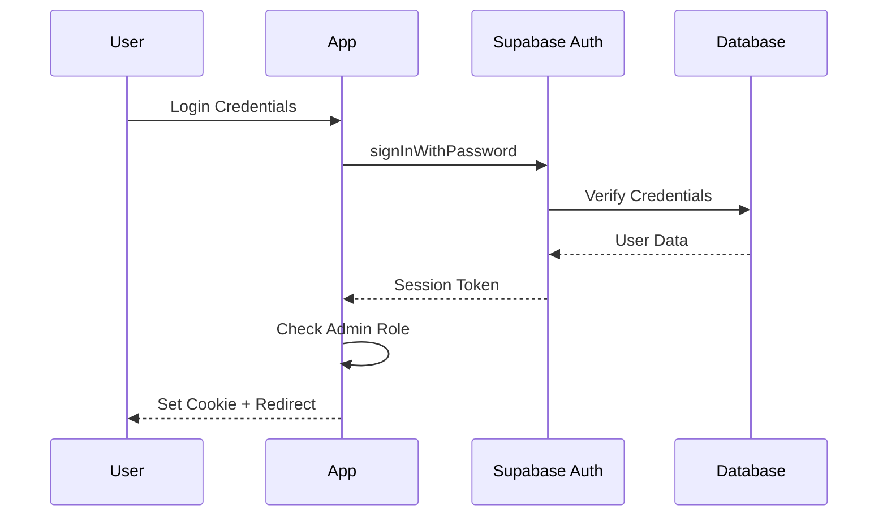

# Security Documentation

Security practices, guidelines, and procedures for the SDBA Admin System.

## 📋 Table of Contents

- [Security Overview](#security-overview)
- [Authentication & Authorization](#authentication--authorization)
- [Data Protection](#data-protection)
- [Input Validation & Sanitization](#input-validation--sanitization)
- [CSRF Protection](#csrf-protection)
- [Rate Limiting](#rate-limiting)
- [Error Handling](#error-handling)
- [Secure Configuration](#secure-configuration)
- [Security Best Practices](#security-best-practices)
- [Reporting Security Issues](#reporting-security-issues)

## 🔒 Security Overview

The SDBA Admin System implements multiple layers of security to protect against common web vulnerabilities:

- ✅ **Authentication**: Supabase Auth with role-based access control
- ✅ **Authorization**: Admin-only endpoints with privilege checks
- ✅ **CSRF Protection**: Double-submit cookie pattern
- ✅ **Rate Limiting**: IP-based and user-based limits
- ✅ **Input Sanitization**: XSS prevention with DOMPurify
- ✅ **SQL Injection Prevention**: Parameterized queries via Supabase
- ✅ **Row-Level Security**: Database-level access control
- ✅ **Secure Cookies**: HttpOnly, Secure, SameSite attributes
- ✅ **HTTPS**: TLS encryption in transit
- ✅ **Error Handling**: No sensitive data exposure

## 🔐 Authentication & Authorization

### Authentication Flow



### Admin Authorization

Admin users are identified by:
- `app_metadata.role === 'admin'`
- `user_metadata.role === 'admin'`
- `user_metadata.is_admin === true`

**Authorization Check:**
```typescript
// lib/auth.ts
export function isAdminUser(user: User | null): boolean {
  if (!user) return false;
  
  const roles = (user?.app_metadata?.roles ?? user?.user_metadata?.roles ?? []) as string[];
  const role = (user?.app_metadata?.role ?? user?.user_metadata?.role) as string | undefined;
  
  return roles?.includes("admin") || role === "admin" || user?.user_metadata?.is_admin === true;
}
```

### Session Management

- **Session Storage**: Secure HTTP-only cookies
- **Session Expiry**: Managed by Supabase (default: 1 hour)
- **Session Validation**: Verified on every admin request
- **Logout**: Clears session cookie and Supabase session

## 🛡 Data Protection

### Encryption in Transit

- **HTTPS**: All traffic encrypted with TLS 1.2+
- **Secure Cookies**: Only sent over HTTPS in production
- **API Communication**: All API calls use HTTPS

### Encryption at Rest

- **Database**: Supabase encrypts data at rest
- **Backups**: Encrypted backups
- **Environment Variables**: Stored securely in Vercel

### Sensitive Data Handling

**Never Logged:**
- Passwords
- Session tokens
- API keys
- Personal information (PII) in production logs

**Sanitized in Logs:**
- Email addresses (hashed or masked)
- User IDs (if necessary)
- IP addresses (last octet masked)

## ✅ Input Validation & Sanitization

### Validation

All API inputs are validated using Zod schemas:

```typescript
// Example: Registration approval
const ApprovePayload = z.object({
  registration_id: z.string().uuid(),
  notes: z.string().optional().transform((val) => val ? sanitizeNotes(val) : undefined),
});
```

### Sanitization

**HTML Sanitization:**
- Uses `isomorphic-dompurify` for server and client
- Strips dangerous HTML tags and attributes
- Allows safe formatting tags only

**Text Sanitization:**
- Removes HTML tags
- Escapes special characters
- Validates email formats

**File Name Sanitization:**
- Removes path traversal attempts (`../`)
- Removes dangerous characters
- Limits length

### XSS Prevention

- **Output Encoding**: All user input is sanitized before display
- **Content Security Policy**: CSP headers restrict script execution
- **DOMPurify**: Sanitizes HTML content
- **React**: Automatic XSS protection via JSX

## 🛡 CSRF Protection

### Implementation

**Double-Submit Cookie Pattern:**
1. Server generates CSRF token
2. Token stored in secure cookie (`__Host-csrf-token`)
3. Token also sent in response body
4. Client includes token in `X-CSRF-Token` header for state-changing requests
5. Server verifies cookie and header tokens match

**Token Generation:**
```typescript
// lib/csrf.ts
export function generateCsrfToken(): string {
  const token = randomBytes(32).toString("hex");
  const hmac = createHmac("sha256", getCsrfSecret());
  hmac.update(token);
  const signature = hmac.digest("hex");
  return `${token}.${signature}`;
}
```

**Token Verification:**
- Timing-safe comparison to prevent timing attacks
- HMAC signature verification
- Cookie and header must match

### Protected Methods

CSRF protection applies to:
- `POST`
- `PUT`
- `DELETE`
- `PATCH`

Exempt methods:
- `GET`
- `HEAD`
- `OPTIONS`

## 🚦 Rate Limiting

### Limits

**Public API:**
- 10 requests per 10 seconds per IP

**Admin API:**
- 100 requests per minute per authenticated user
- Falls back to IP-based limiting if not authenticated

### Implementation

**Storage:**
- Production: Upstash Redis (distributed)
- Development: In-memory (single instance)

**Headers:**
```
X-RateLimit-Limit: 100
X-RateLimit-Remaining: 95
X-RateLimit-Reset: 1640995200
```

**Response (429):**
```json
{
  "ok": false,
  "error": "Rate limit exceeded",
  "code": "RATE_LIMIT_EXCEEDED"
}
```

## ⚠️ Error Handling

### Error Response Format

All errors follow consistent format without exposing sensitive information:

```json
{
  "ok": false,
  "error": "User-friendly error message",
  "code": "ERROR_CODE"
}
```

### Never Exposed

- Database connection strings
- API keys or secrets
- Stack traces (in production)
- Internal file paths
- User passwords or tokens

### Error Logging

- **Development**: Full stack traces in console
- **Production**: Errors logged to Sentry (sanitized)
- **Sensitive Data**: Never logged

## ⚙️ Secure Configuration

### Environment Variables

**Required:**
- `NEXT_PUBLIC_SUPABASE_URL`
- `NEXT_PUBLIC_SUPABASE_ANON_KEY`
- `SUPABASE_SERVICE_ROLE_KEY` (server-only)
- `CSRF_SECRET` (strong random secret)

**Best Practices:**
- Never commit `.env.local` to version control
- Use different secrets for each environment
- Rotate secrets regularly
- Use strong random secrets (32+ bytes)

### Cookie Configuration

```typescript
// Secure cookie settings
{
  httpOnly: true,        // Not accessible via JavaScript
  secure: true,          // HTTPS only (production)
  sameSite: 'strict',    // CSRF protection
  path: '/',             // Available site-wide
  // __Host- prefix requires secure and path=/
}
```

### Content Security Policy

CSP headers restrict:
- Script execution (only from same origin)
- Inline scripts (blocked)
- External resources (whitelisted domains only)
- Data URIs (restricted)

## 🔒 Security Best Practices

### For Developers

1. **Never commit secrets**: Use `.env.local` and `.gitignore`
2. **Validate all inputs**: Use Zod schemas
3. **Sanitize outputs**: Use DOMPurify for HTML
4. **Use parameterized queries**: Never concatenate SQL
5. **Check authorization**: Verify admin role on every request
6. **Handle errors safely**: Don't expose sensitive information
7. **Keep dependencies updated**: Regular security audits
8. **Use HTTPS**: Always in production
9. **Implement rate limiting**: Prevent abuse
10. **Log security events**: Monitor for suspicious activity

### For Administrators

1. **Use strong passwords**: Minimum 12 characters, mixed case, numbers, symbols
2. **Enable 2FA**: Where available (Supabase, Vercel)
3. **Rotate secrets regularly**: Every 90 days
4. **Monitor logs**: Check for suspicious activity
5. **Keep systems updated**: Regular security patches
6. **Limit admin access**: Only grant to trusted users
7. **Review audit logs**: Regular security audits
8. **Backup data**: Regular encrypted backups
9. **Test disaster recovery**: Regular recovery drills
10. **Stay informed**: Follow security advisories

### For Users

1. **Use strong passwords**: Unique, complex passwords
2. **Don't share credentials**: Each user should have own account
3. **Log out when done**: Especially on shared computers
4. **Report suspicious activity**: Immediately notify administrators
5. **Keep browser updated**: Latest security patches

## 🐛 Reporting Security Issues

### Responsible Disclosure

**Do NOT** open public issues for security vulnerabilities.

### Reporting Process

1. **Email**: security@example.com
2. **Subject**: `[SECURITY] Brief description`
3. **Include**:
   - Description of vulnerability
   - Steps to reproduce
   - Potential impact
   - Suggested fix (if any)
   - Your contact information

### Response Timeline

- **Initial Response**: Within 24 hours
- **Status Update**: Within 7 days
- **Fix Timeline**: Depends on severity
- **Public Disclosure**: After fix is deployed

### Severity Levels

- **Critical**: Remote code execution, data breach
- **High**: Privilege escalation, authentication bypass
- **Medium**: Information disclosure, CSRF
- **Low**: Minor information leakage, best practice violations

## 🔍 Security Checklist

### Pre-Deployment

- [ ] All environment variables set
- [ ] Strong CSRF secret generated
- [ ] HTTPS enabled
- [ ] Secure cookies configured
- [ ] Rate limiting enabled
- [ ] Input validation implemented
- [ ] Error handling secure
- [ ] Dependencies updated
- [ ] Security headers configured
- [ ] Database RLS policies active

### Post-Deployment

- [ ] Authentication working
- [ ] Authorization enforced
- [ ] CSRF protection active
- [ ] Rate limiting functional
- [ ] Error monitoring configured
- [ ] Logs reviewed
- [ ] Security headers verified
- [ ] HTTPS certificate valid
- [ ] Admin access limited
- [ ] Backups configured

## 📚 Additional Resources

- [OWASP Top 10](https://owasp.org/www-project-top-ten/)
- [Next.js Security](https://nextjs.org/docs/advanced-features/security-headers)
- [Supabase Security](https://supabase.com/docs/guides/platform/security)
- [Vercel Security](https://vercel.com/docs/security)

---

**Last Updated**: 2025-01-01

**Security Contact**: security@example.com

