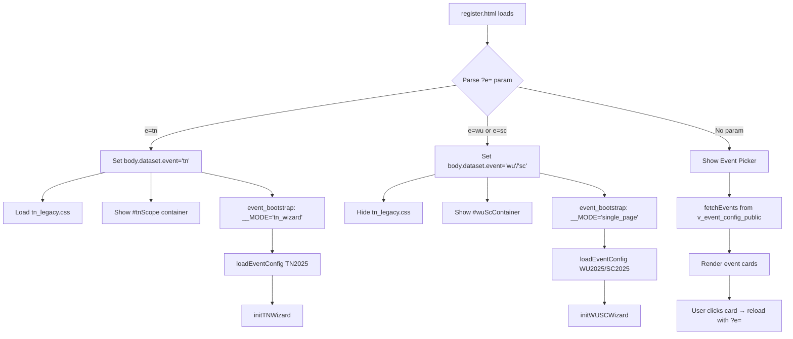
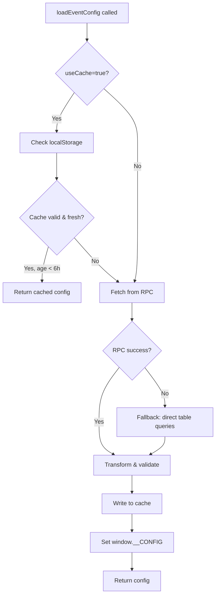
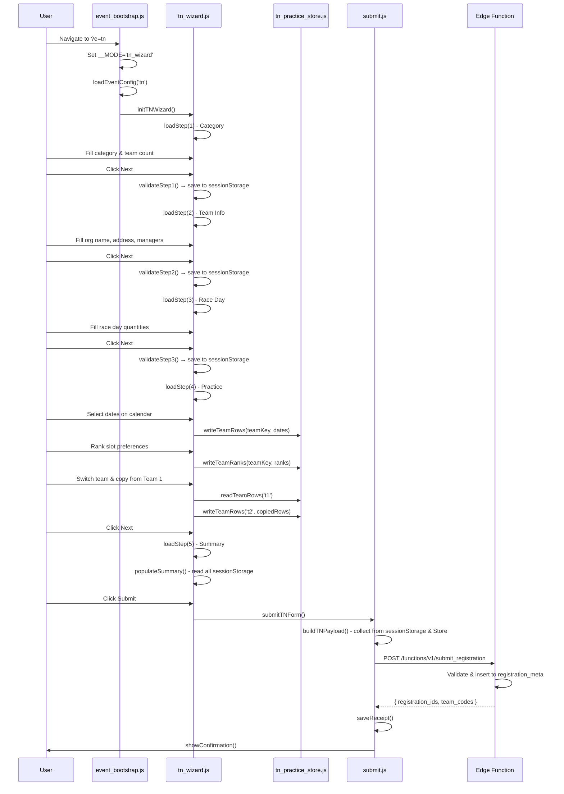
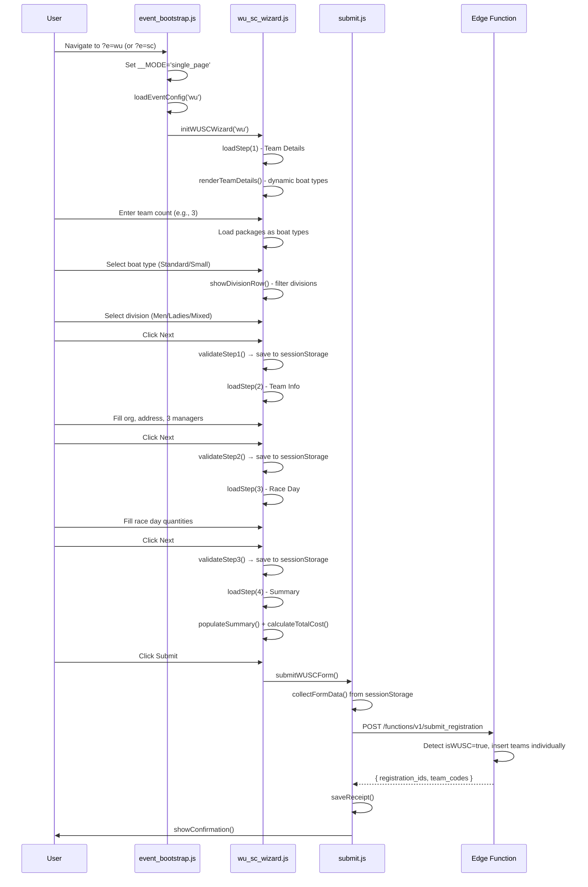
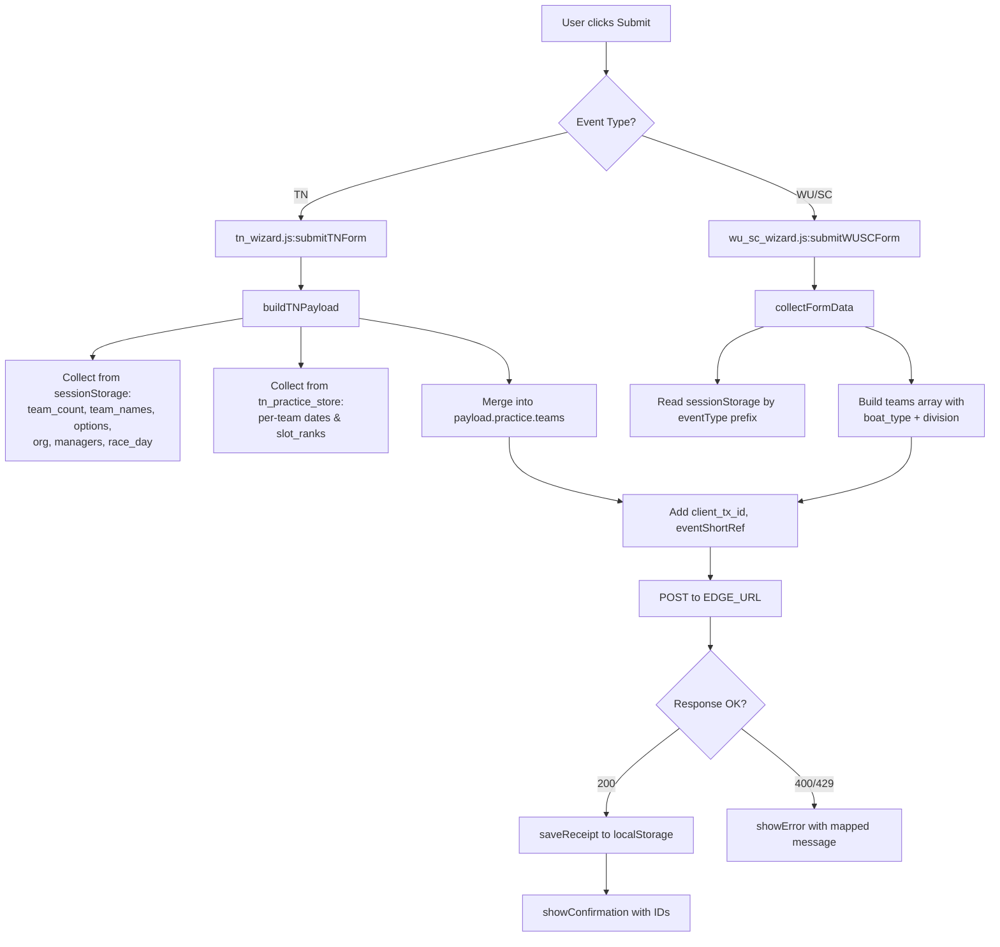
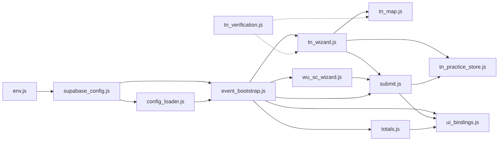

# Form Code Flow Report: TN / WU / SC Registration Forms

**Generated:** 2025-11-02  
**Repository:** SDBA Admin System  
**Event Types:** TN (Traditional Dragon Boat), WU (Warm-Up), SC (Short Course)

---

## Table of Contents

1. [Repository Map](#1-repository-map)
2. [Universal Routing Overview](#2-universal-routing-overview)
3. [Config Load & Guardrails](#3-config-load--guardrails)
4. [Form Code Flow: TN](#4-form-code-flow-tn)
5. [Form Code Flow: WU/SC](#5-form-code-flow-wusc)
6. [Submission Flow & API Contract](#6-submission-flow--api-contract)
7. [Dependency & Responsibilities Map](#7-dependency--responsibilities-map)
8. [Dev/Prod Guards & Debug Hooks](#8-devprod-guards--debug-hooks)
9. [Risks & Quick Wins](#9-risks--quick-wins)
10. [Appendix: Key Anchors](#appendix-key-anchors)

---

## 1. Repository Map

### Relevant Files by Category

```
📦 SDBA_admin_system/
├── 📂 public/
│   ├── 📄 register.html                    [Entry] Universal entry point
│   ├── 📄 tn_templates.html                [Template] TN wizard steps 1-5
│   ├── 📄 wu_sc_templates.html             [Template] WU/SC wizard steps 1-4
│   ├── 📄 env.js                           [Config] Supabase credentials
│   ├── 📄 supabase_config.js               [Config] Supabase client init
│   │
│   ├── 📂 js/
│   │   ├── 📄 config_loader.js             [Config] Event config fetcher with cache
│   │   ├── 📄 event_bootstrap.js           [Router] Mode detection & init dispatcher
│   │   │
│   │   ├── 📄 tn_wizard.js                 [State+UI] TN multi-step wizard orchestrator
│   │   ├── 📄 tn_map.js                    [State] TN legacy selector → payload mapper
│   │   ├── 📄 tn_practice_store.js         [State] TN practice sessionStorage wrapper
│   │   ├── 📄 tn_verification.js           [Validator] TN acceptance test harness
│   │   │
│   │   ├── 📄 wu_sc_wizard.js              [State+UI] WU/SC multi-step wizard
│   │   │
│   │   ├── 📄 submit.js                    [Submitter] Universal submission handler
│   │   ├── 📄 totals.js                    [Calculator] Cost estimation engine
│   │   └── 📄 ui_bindings.js               [UI Binder] Dynamic form renderer (unused for TN/WU/SC)
│   │
│   └── 📂 css/
│       ├── 📄 theme.css                    Shared theme variables
│       └── 📄 tn_legacy.css                TN-specific styles (conditionally loaded)
│
├── 📂 supabase/functions/
│   └── 📂 submit_registration/
│       └── 📄 index.ts                     [Edge Function] Registration handler
│
├── 📂 DB Config/
│   ├── 📄 annual.sql                       Annual event configuration
│   ├── 📄 division.sql                     Division definitions
│   ├── 📄 rpc.sql                          RPC functions for config loading
│   └── 📄 view.sql                         Public views for forms
│
├── 📂 db_schema/
│   └── 📄 main.sql                         Core schema (team_meta, registration_meta, etc.)
│
└── 📂 tests/
    └── 📄 tn_step4.spec.ts                 [Test] Practice booking validation

```

### File Responsibilities

| File | Type | Responsibility |
|------|------|----------------|
| `register.html` | Entry | Universal HTML shell, loads all scripts |
| `tn_templates.html` | Template | 5 legacy step templates (category, team info, race day, practice, summary) |
| `wu_sc_templates.html` | Template | 4 step templates (team details with boat type, team info, race day, summary) |
| `env.js` | Config | Hardcoded Supabase URL & anon key |
| `supabase_config.js` | Config | Creates Supabase client, exports `sb` |
| `config_loader.js` | Config | Fetches event config via RPC, caches 6h in localStorage |
| `event_bootstrap.js` | Router | Parses `?e=` param, sets `window.__MODE`, dispatches to wizard |
| `tn_wizard.js` | State+UI | TN orchestrator: step nav, calendar rendering, practice storage |
| `tn_map.js` | State | Maps legacy TN DOM selectors to universal payload shape |
| `tn_practice_store.js` | State | SessionStorage CRUD for per-team practice rows & slot ranks |
| `tn_verification.js` | Validator | Automated acceptance tests (template cloning, selector mapping) |
| `wu_sc_wizard.js` | State+UI | WU/SC orchestrator: dynamic boat type/division selection |
| `submit.js` | Submitter | Builds payload, POSTs to edge function, handles idempotency |
| `totals.js` | Calculator | Sums packages + race day items + practice hours |
| `ui_bindings.js` | UI Binder | Dynamic form builder (skipped for TN/WU/SC, uses templates) |

---

## 2. Universal Routing Overview

### Entry Point: `register.html?e={tn|wu|sc}`

**File:** `public/register.html:359-386`

```html
<script>
  // Set up TN legacy CSS scoping based on event parameter
  (function() {
    const urlParams = new URLSearchParams(window.location.search);
    const eventShortRef = urlParams.get('e');
    
    if (eventShortRef === 'tn') {
      // Set body dataset for TN legacy CSS scoping
      document.body.dataset.event = 'tn';
      
      // Show TN legacy CSS
      const tnLegacyCSS = document.getElementById('tnLegacyCSS');
      if (tnLegacyCSS) {
        tnLegacyCSS.disabled = false;
      }
      
      // Show TN scope container, hide WU/SC container
      const tnScope = document.getElementById('tnScope');
      const wuScContainer = document.getElementById('wuScContainer');
      
      if (tnScope) tnScope.hidden = false;
      if (wuScContainer) wuScContainer.hidden = true;
    } else {
      // For WU/SC events, show WU/SC container, hide TN scope
      const tnScope = document.getElementById('tnScope');
      const wuScContainer = document.getElementById('wuScContainer');
      
      if (tnScope) tnScope.hidden = true;
      if (wuScContainer) wuScContainer.hidden = false;
    }
  })();
</script>
```

### Mode Detection & Assignment

**File:** `public/js/event_bootstrap.js:329-330`

```javascript
// Boot rules: if e=tn → tn_wizard, if e=wu|sc → single_page
window.__MODE = (ref === 'tn') ? 'tn_wizard' : 'single_page';
window.__PRACTICE_ENABLED = (window.__MODE === 'tn_wizard');
```

### Template Loading

**TN Templates:**  
`public/register.html:330-340` - Fetches `tn_templates.html` and appends `<template>` nodes to `<body>`

**WU/SC Templates:**  
`public/register.html:342-352` - Fetches `wu_sc_templates.html` and appends `<template>` nodes to `<body>`

### Dispatch Flow



---

## 3. Config Load & Guardrails

### Configuration Sources

**File:** `public/js/config_loader.js:136-172`

1. **Primary:** RPC function `rpc_load_event_config(p_event_short_ref)`
2. **Fallback:** Direct table queries (`annual_event_config`, `division`, `package`, etc.)
3. **Cache:** localStorage key `raceApp:config:{eventShortRef}` (6-hour TTL)

### Cache Strategy



### Validation & Failure Modes

**File:** `public/js/config_loader.js:102-129`

```javascript
function validateConfig(config) {
  if (!config || typeof config !== 'object') {
    throw new Error('Invalid configuration: not an object');
  }
  
  const requiredFields = [
    'config_version',
    'event',
    'divisions',
    'packages',
    'race_day_items',
    'practice',
    'profiles'
  ];
  
  for (const field of requiredFields) {
    if (!(field in config)) {
      throw new Error(`Invalid configuration: missing field '${field}'`);
    }
  }
  
  // Validate event object
  if (!config.event || !config.event.event_short_ref) {
    throw new Error('Invalid configuration: event object missing or invalid');
  }
  
  return true;
}
```

### Failure Modes

| Scenario | Handler | Fallback |
|----------|---------|----------|
| RPC fails | `config_loader.js:162-172` | Direct table queries |
| Network error | `event_bootstrap.js:389-393` | Show event picker with error message |
| Invalid config | `config_loader.js:158` | Throws error, caught by bootstrap |
| Missing event | `config_loader.js:151` | Throws "No configuration found" |

### Config Binding to `window.__CONFIG`

**File:** `public/js/config_loader.js:286-299`

```javascript
// Set global configuration
window.__CONFIG = cached.config;

// ... later after fetch ...

// Set global configuration
window.__CONFIG = config;
```

---

## 4. Form Code Flow: TN

### Overview

TN uses a **5-step wizard** with legacy templates cloned from `tn_templates.html`. Each step stores data in `sessionStorage` for inter-step persistence.

### Sequence Diagram



### State Containers

| Container | Location | Keys | Purpose |
|-----------|----------|------|---------|
| `sessionStorage` | Browser | `tn_team_count`, `tn_team_name_{i}`, `tn_team_category_{i}`, `tn_team_option_{i}`, `tn_org_name`, `tn_org_address`, `tn_manager_{i}_*`, `tn_race_day_*` | Core form data across steps 1-3 |
| `tn_practice_store.js` | `sessionStorage` | `tn_practice_team_{teamKey}`, `tn_slot_ranks_{teamKey}`, `tn.practice.current_team` | Per-team practice dates & slot rankings |
| `window.__CONFIG` | Memory | Event config object | Prices, divisions, packages, timeslots |

### Key Validators

**File:** `public/js/tn_wizard.js:2600-2750` (Step validation functions)

- **`validateStep1()`** - Ensures category + team count + option distribution
- **`validateStep2()`** - Requires org name, address, and manager contacts
- **`validateStep3()`** - No strict validation (race day optional)
- **`validateStep4()`** - Validates practice dates within window, checks total hours
- **`validateStep5()`** - Final pre-submit check (honeypot, completeness)

### TN-Specific Branches

**Practice Booking (TN Only):**

- **Calendar Rendering:** `tn_wizard.js:1400-1600` - Generates monthly calendar grid
- **Date Selection:** `tn_wizard.js:1650-1750` - Checkbox + duration/helper dropdowns
- **Slot Ranking:** `tn_wizard.js:1850-1950` - 2h & 1h preference dropdowns (max 3 each)
- **Team Switching:** `tn_wizard.js:1350-1400` - Dropdown to switch between teams, auto-save on switch
- **Copy from Team 1:** `tn_wizard.js:2100-2200` - Button to clone Team 1's practice data

**No Practice for WU/SC:** `event_bootstrap.js:330` sets `window.__PRACTICE_ENABLED = false` for non-TN events.

---

## 5. Form Code Flow: WU/SC

### Overview

WU/SC uses a **4-step wizard** with simplified structure (no practice booking). Key difference: **Step 1 dynamically generates boat type & division selection** based on event config.

### Sequence Diagram



### State Containers

| Container | Location | Keys | Purpose |
|-----------|----------|------|---------|
| `sessionStorage` | Browser | `{eventType}_team_count`, `{eventType}_team{i}_name`, `{eventType}_team{i}_boatType`, `{eventType}_team{i}_division`, `{eventType}_orgName`, `{eventType}_mailingAddress`, `{eventType}_manager{i}_*`, `{eventType}_*Qty` | All form data (eventType = 'wu' or 'sc') |
| `window.__CONFIG` | Memory | Event config object | Packages (boat types), divisions, race day items |

### Key Validators

**File:** `public/js/wu_sc_wizard.js:916-1066`

- **`validateStep1()`** - Ensures team count, names, boat types, and divisions selected
- **`validateStep2()`** - Requires org name, address, and 2 managers (3rd optional)
- **`validateStep3()`** - No strict validation (race day optional)
- **`validateStep4()`** - No validation (summary is read-only)

### Event-Specific Branches

**Boat Type & Division Filtering:**

**File:** `public/js/wu_sc_wizard.js:456-483`

```javascript
async function loadBoatTypesForTeam(teamIndex, cfg) {
  const container = document.getElementById(`boatType${teamIndex}`);
  const packages = cfg.packages || [];
  
  // Filter out "By Invitation" option
  const validPackages = packages.filter(pkg => pkg.title_en !== 'By Invitation');
  
  validPackages.forEach((pkg, index) => {
    // Create radio button for each boat type (e.g., Standard Boat, Small Boat)
    // Price displayed: HK${pkg.listed_unit_price}
  });
  
  // Show divisions when boat type is selected
  radio.addEventListener('change', () => {
    showDivisionRow(teamIndex);
  });
}
```

**File:** `public/js/wu_sc_wizard.js:504-548`

```javascript
function showDivisionRow(teamIndex) {
  const selectedBoatType = document.querySelector(`input[name="boatType${teamIndex}"]:checked`);
  const boatType = selectedBoatType.value; // e.g., "Standard Boat"
  
  const allDivisions = JSON.parse(divisionContainer.dataset.allDivisions || '[]');
  
  // Filter divisions based on boat type
  let filteredDivisions = [];
  if (boatType === 'Standard Boat') {
    filteredDivisions = allDivisions.filter(div => 
      div.name_en.includes('Standard Boat') && 
      (div.name_en.includes('Men') || div.name_en.includes('Ladies') || div.name_en.includes('Mixed'))
    );
  } else if (boatType === 'Small Boat') {
    filteredDivisions = allDivisions.filter(div => 
      div.name_en.includes('Small Boat') && 
      (div.name_en.includes('Men') || div.name_en.includes('Ladies') || div.name_en.includes('Mixed'))
    );
  }
  
  // Render filtered divisions as radio buttons
}
```

---

## 6. Submission Flow & API Contract

### Entry Point

**File:** `public/js/submit.js:187-212` (TN calls via `tn_wizard.js:submitTNForm()`)  
**File:** `public/js/wu_sc_wizard.js:1082-1126` (WU/SC)

### Payload Construction



### Edge Function Endpoint

**URL:** `${SUPABASE_URL}/functions/v1/submit_registration`  
**File:** `supabase/functions/submit_registration/index.ts`

### Payload Schema

#### TN Payload

```typescript
{
  eventShortRef: "TN2025",
  category: "men_open" | "ladies_open" | "mixed_open" | "mixed_corporate",
  season: 2025,
  org_name: string,
  org_address?: string,
  counts: {
    num_teams: number,
    num_teams_opt1: number,
    num_teams_opt2: number
  },
  team_names: string[],
  team_options: ("opt1" | "opt2")[],
  managers: [
    { name: string, mobile: string, email: string }, // Manager 1
    { name: string, mobile: string, email: string }, // Manager 2
    { name: string, mobile: string, email: string }  // Manager 3 (optional)
  ],
  race_day?: {
    marqueeQty?: number,
    steerWithQty?: number,
    steerWithoutQty?: number,
    junkBoatNo?: string,
    junkBoatQty?: number,
    speedBoatNo?: string,
    speedboatQty?: number
  },
  practice?: {
    teams: [
      {
        team_key: "t1" | "t2" | ...,
        dates: [
          { pref_date: "YYYY-MM-DD", duration_hours: 1|2, helper: "NONE"|"S"|"T"|"ST" }
        ],
        slot_ranks: [
          { rank: 1|2|3, slot_code: "SAT2_0800_1000" }
        ]
      }
    ]
  },
  client_tx_id: string // UUID for idempotency
}
```

#### WU/SC Payload

```typescript
{
  eventShortRef: "WU2025" | "SC2025",
  category: string, // First team's division (e.g., "Standard Boat – Men")
  season: 2025,
  org_name: string,
  org_address?: string,
  teams: [
    {
      name: string,
      boat_type: "Standard Boat" | "Small Boat",
      division: "Men" | "Ladies" | "Mixed" | ...,
      category: string // Combined: "Standard Boat – Men"
    }
  ],
  managers: [
    { name: string, mobile: string, email: string }, // Manager 1
    { name: string, mobile: string, email: string }, // Manager 2
    { name: string, mobile: string, email: string }  // Manager 3 (optional)
  ],
  race_day: {
    marqueeQty: number,
    steerWithQty: number,
    steerWithoutQty: number,
    junkBoatNo?: string,
    junkBoatQty: number,
    speedBoatNo?: string,
    speedboatQty: number
  },
  client_tx_id: string
}
```

### Idempotency Logic

**File:** `supabase/functions/submit_registration/index.ts:486-501`

```typescript
const { data: insertedRegistrations, error: regError } = await admin
  .from('registration_meta')
  .insert(registrationsToInsert) // Contains client_tx_id
  .select('id, team_code');
```

**Constraint:** `registration_meta` table has unique constraint on `(client_tx_id, team_name)` to prevent duplicate submissions.

**Client-side ID generation:** `public/js/submit.js:20-28`

```javascript
function getClientTxId() {
  const key = 'raceApp:client_tx_id';
  let id = localStorage.getItem(key);
  if (!id) {
    id = (self.crypto?.randomUUID && self.crypto.randomUUID()) 
         || String(Date.now()) + Math.random().toString(16).slice(2);
    localStorage.setItem(key, id);
  }
  return id;
}
```

### Response Shape

**Success (200):**

```json
{
  "registration_ids": ["uuid1", "uuid2", "uuid3"],
  "team_codes": ["TN25M001", "TN25M002", "TN25M003"]
}
```

**Error (400):**

```json
{
  "error": "E.PRACTICE_WINDOW: Practice date is outside allowed window",
  "details": "...",
  "debug": { ... }
}
```

### UI Response Handling

**Success:** `public/js/submit.js:151-185`

```javascript
function showConfirmation({ registration_id, team_codes }) {
  const box = document.getElementById('confirmationBox');
  if (!box) return;
  const idEl = document.getElementById('registrationId');
  const codesEl = document.getElementById('teamCodes');
  if (idEl) idEl.textContent = registration_id || '';
  if (codesEl) codesEl.textContent = Array.isArray(team_codes) ? team_codes.join(', ') : '';
  box.style.display = 'block';
  // ... copy/share buttons ...
}
```

**Error:** `public/js/submit.js:122-128`

```javascript
function showError(message, details) {
  const box = document.getElementById('errorBox');
  const span = document.getElementById('errorMessage');
  if (span) span.textContent = message || 'Error';
  if (box) box.style.display = 'block';
  console.warn('submit error', { message, details });
}
```

### DB Tables Impacted

**File:** `supabase/functions/submit_registration/index.ts:486-501`

1. **`registration_meta`** - Stores pending registrations (one row per team)
   - Columns: `event_type`, `event_short_ref`, `client_tx_id`, `season`, `category`, `division_code`, `option_choice`, `team_name`, `org_name`, `org_address`, `team_manager_1-3`, `mobile_1-3`, `email_1-3`, `status='pending'`
   - After admin approval, teams are moved to `team_meta`

2. **`race_day_requests`** - Created after approval (not at submission)
3. **`practice_preferences`** - Created after approval (not at submission)

**Note:** The edge function v3.0+ stores **individual team records** in `registration_meta`, not aggregate data. Practice data is stored in `registration_meta` for later processing.

---

## 7. Dependency & Responsibilities Map

### Module Responsibilities

| Module | Imports | Exports | Responsibility |
|--------|---------|---------|----------------|
| `env.js` | - | `window.ENV` | Hardcoded Supabase credentials |
| `supabase_config.js` | `@supabase/supabase-js` | `sb` (client) | Initializes Supabase client with auth disabled |
| `config_loader.js` | `sb` | `loadEventConfig()`, `clearConfigCache()` | Fetches & caches event config (RPC → tables fallback) |
| `event_bootstrap.js` | `sb`, `loadEventConfig`, `initFormForEvent`, `bindTotals`, `bindSubmit`, `initTNWizard` | `boot()` | Parses ?e=, sets __MODE, dispatches to wizard |
| `tn_wizard.js` | `sb`, `TN_SELECTORS`, `tn_practice_store`, `submit` utils | `initTNWizard()` | Orchestrates 5-step TN wizard, calendar, practice storage |
| `tn_map.js` | - | `TN_SELECTORS`, `collectTNState()`, `validateTNState()` | Maps legacy TN DOM → universal payload |
| `tn_practice_store.js` | - | `readTeamRows()`, `writeTeamRows()`, `readTeamRanks()`, `writeTeamRanks()` | SessionStorage CRUD for practice data |
| `tn_verification.js` | - | `window.verifyTN` | Acceptance test suite (runs in browser console) |
| `wu_sc_wizard.js` | `sb`, `submit` utils | `initWUSCWizard()` | Orchestrates 4-step WU/SC wizard, dynamic boat type selection |
| `submit.js` | `ui_bindings`, `tn_practice_store` | `bindSubmit()`, `EDGE_URL`, utils | Builds payload, POSTs to edge, handles response |
| `totals.js` | `ui_bindings` | `bindTotals()`, `recomputeTotals()` | Calculates estimated cost from form state |
| `ui_bindings.js` | - | `initFormForEvent()`, `collectStateFromForm()` | Dynamic form builder (unused for TN/WU/SC) |

### Dependency Graph



### One-Way Boundaries

✅ **Good Separation:**
- Wizards (`tn_wizard.js`, `wu_sc_wizard.js`) only call `submit.js`, never hit edge directly
- `tn_practice_store.js` is a pure data layer (no UI knowledge)
- `submit.js` is agnostic to wizard type (uses `collectStateFromForm` or passed data)

⚠️ **Tight Coupling:**
- `tn_wizard.js` is tightly coupled to legacy template IDs (e.g., `#raceCategory`, `#teamCount`)
- `wu_sc_wizard.js` directly manipulates sessionStorage (no shared abstraction with TN)
- `event_bootstrap.js` has if/else branching for TN vs WU/SC (no plugin architecture)

---

## 8. Dev/Prod Guards & Debug Hooks

### Debug Flags

**File:** `public/js/event_bootstrap.js:329-331`

```javascript
window.__MODE = (ref === 'tn') ? 'tn_wizard' : 'single_page';
window.__PRACTICE_ENABLED = (window.__MODE === 'tn_wizard');
console.info('Boot → event=', ref, 'mode=', window.__MODE);
```

**File:** `public/js/event_bootstrap.js:435-477`

```javascript
// QA helper
window.__DBG = {
  dumpState: async () => { /* ... */ },
  refreshConfig: async () => { /* ... */ },
  clearCache: () => { /* ... */ }
};
```

### TN Debug Functions

**File:** `public/js/tn_wizard.js:14-83`

```javascript
window.__DBG_TN = {
  fillSingleTeam: fillSingleTeamForSubmission,
  fillMultipleTeams: fillMultipleTeamsForSubmission,
  testSubmission: testSubmissionWithCurrentData,
  generateFreshTxId: generateFreshClientTxId,
  clearStep4: clearStep4Data,
  clearStep5: clearAllData,
  startFresh: startFresh,
  testTeamSwitch: testTeamSwitchFunction,
  testCopyButton: testCopyButton,
  saveCurrentTeam: saveCurrentTeamPracticeData,
  testCalendarData: testCalendarDataCollection,
  readTeamRows: readTeamRows,
  readTeamRanks: readTeamRanks,
  // ... data collection functions ...
};
```

### WU/SC Debug Functions

**File:** `public/js/wu_sc_wizard.js:50-72`

```javascript
window.__DBG_WUSC = {
  fillStep1: fillStep1TestData,
  fillStep2: fillStep2TestData,
  fillStep3: fillStep3TestData,
  fillAll: fillAllTestData,
  goToStep: loadStep
};

// Also exposed directly on window
window.fillWUSCStep1 = fillStep1TestData;
window.fillWUSCStep2 = fillStep2TestData;
window.fillWUSCStep3 = fillStep3TestData;
window.fillWUSCAll = fillAllTestData;
```

### Hostname/Environment Detection

**None detected.** All CORS and environment variables are managed server-side in the edge function.

**File:** `supabase/functions/submit_registration/index.ts:22-29`

```typescript
const CORS_LIST = (Deno.env.get("CORS_ALLOW_ORIGINS") ??
  "*,http://localhost:3000,http://127.0.0.1:3000,http://localhost:5500,http://127.0.0.1:5500")
  .split(",")
  .map(s => s.trim())
  .filter(Boolean);
```

### Production Safety Assessment

| Feature | Gated? | Risk Level | Notes |
|---------|--------|------------|-------|
| `window.__DBG` | ✅ Gated by `__DEV__` | 🟢 None | Only exposed on localhost/127.0.0.1 |
| `window.__DBG_TN` | ✅ Gated by `__DEV__` | 🟢 None | Only exposed on localhost/127.0.0.1 |
| `window.__DBG_WUSC` | ✅ Gated by `__DEV__` | 🟢 None | Only exposed on localhost/127.0.0.1 |
| Console logging | ❌ Always on | 🟢 None | Standard `console.log/warn/error` |
| CORS wildcard | ✅ Env-driven | 🟢 None | Server controls via `CORS_ALLOW_ORIGINS` |
| Supabase keys | ❌ Hardcoded in `env.js` | 🟢 None | Anon key is safe to expose |

**Status:** ✅ Debug helpers are properly gated behind `window.__DEV__` flag (defined in `env.js`). Only exposed when `location.hostname` is `localhost` or `127.0.0.1`.

---

## 9. Risks & Quick Wins

### Risks

#### 1. Tight Coupling Between Modules

**Issue:** `tn_wizard.js` is tightly coupled to specific legacy template IDs (e.g., `#raceCategory`, `#teamCount`). Changes to templates require code changes.

**Impact:** 🔴 High - Maintenance burden, fragile refactors

**Mitigation:** Use `tn_map.js` selector constants more consistently, avoid hardcoded IDs in wizard logic.

---

#### 2. Duplicate Logic Across TN vs WU/SC

**Issue:** Both `tn_wizard.js` and `wu_sc_wizard.js` implement similar step navigation, validation, and sessionStorage patterns with no shared abstraction.

**Example:**
- **TN:** `tn_wizard.js:2600-2750` (validateStep1-5)
- **WU/SC:** `wu_sc_wizard.js:916-1066` (validateStep1-4)

**Impact:** 🟡 Medium - Code duplication, inconsistent behavior

**Mitigation:** Extract shared wizard utilities into `wizard_utils.js` (step nav, validation framework, sessionStorage helpers).

---

#### 3. Validation Gaps (Client vs Server)

**Issue:** Client-side validation is basic (required fields, number ranges). Server-side validation is comprehensive but error messages may not map cleanly to UI.

**Example:**
- **Client:** `tn_wizard.js:2650` - Checks if team count > 0
- **Server:** `index.ts:174-183` - Validates num_teams, num_teams_opt1, num_teams_opt2 sum

**Impact:** 🟡 Medium - Poor UX if server rejects after lengthy form fill

**Mitigation:** Strengthen client-side validation to match server rules (e.g., validate option counts before submit).

---

#### 4. Error Handling & UX Fallbacks

**Issue:** Network errors show generic "Network error. Please try again." message. No retry mechanism or save-for-later.

**File:** `submit.js:207-211`

```javascript
} catch (err) {
  showError('Network error. Please try again.', { err });
  btn.dataset.busy = '0';
  btn.disabled = false;
}
```

**Impact:** 🟡 Medium - Data loss on submission failure

**Mitigation:** Add auto-retry logic (exponential backoff) or "Save Draft" button to persist form state.

---

#### 5. SessionStorage Dependency

**Issue:** Form data is stored in `sessionStorage`, which is cleared on tab close. No cross-tab persistence or recovery.

**Impact:** 🟢 Low - Expected behavior for session-based forms, but could frustrate users

**Mitigation:** Add "Resume Later" feature with localStorage + warning banner.

---

### Quick Wins (Non-Breaking Cleanup)

#### 1. ✅ Extract Shared Wizard Utilities

**Effort:** 2-3 hours  
**Benefit:** Reduce duplication by ~30%, improve consistency

**Action:**
- Create `public/js/wizard_utils.js`
- Extract: `loadStep()`, `updateStepper()`, `validateCurrentStep()`, `saveToSessionStorage()`, `loadFromSessionStorage()`
- Refactor `tn_wizard.js` and `wu_sc_wizard.js` to import shared utils

---

#### 2. ✅ Strengthen Client-Side Validation

**Effort:** 1-2 hours  
**Benefit:** Catch errors earlier, reduce server load

**Action:**
- Add option count validation in Step 1 (TN): `num_teams_opt1 + num_teams_opt2 === num_teams`
- Add practice hour limit check (TN): `totalHours <= 12`
- Show inline warnings before user clicks "Next"

---

#### 3. ✅ Add Error Message Mapping

**Effort:** 1 hour  
**Benefit:** Improve UX with friendly error messages

**Action:**
- Expand `submit.js:mapError()` to cover all server error codes
- Add UI-friendly messages in `window.__CONFIG.labels.error_codes`

---

#### 4. ✅ Add Auto-Save Indicator

**Effort:** 30 minutes  
**Benefit:** Improve user confidence

**Action:**
- Add "Saving..." toast on step navigation
- Show "Saved" checkmark after sessionStorage write
- Use existing `step.classList.add('completed')` as visual cue

---

#### 5. ✅ Document Debug Functions in README

**Effort:** 30 minutes  
**Benefit:** Onboard QA/devs faster

**Action:**
- Create `docs/DEBUG_FUNCTIONS.md`
- Document `window.__DBG`, `window.__DBG_TN`, `window.__DBG_WUSC`
- Add usage examples (e.g., `fillWUSCAll()` for E2E tests)

---

## Appendix: Key Anchors

### Mode Selection

| Anchor | File:Line | Description |
|--------|-----------|-------------|
| `?e=` parsing | `register.html:359` | Reads `eventShortRef` from URL query param |
| `__MODE` assignment | `event_bootstrap.js:329` | Sets `window.__MODE = 'tn_wizard' \| 'single_page'` |
| Template routing | `register.html:362-385` | Shows/hides `#tnScope` vs `#wuScContainer` |

### Initial State Creation

| Anchor | File:Line | Description |
|--------|-----------|-------------|
| TN wizard init | `tn_wizard.js:117-147` | `initTNWizard()` - loads step 1, sets up navigation |
| WU/SC wizard init | `wu_sc_wizard.js:20-45` | `initWUSCWizard()` - loads step 1, sets up stepper |
| Config binding | `config_loader.js:299` | `window.__CONFIG = config` |

### Practice Booking (TN Only)

| Anchor | File:Line | Description |
|--------|-----------|-------------|
| Calendar render | `tn_wizard.js:1400-1600` | Generates monthly grid with checkboxes |
| Date selection handler | `tn_wizard.js:1650-1750` | Saves `{ pref_date, duration_hours, helper }` to store |
| Slot ranking handler | `tn_wizard.js:1850-1950` | Saves `{ rank, slot_code }` arrays to store |
| Team switch handler | `tn_wizard.js:1350-1400` | Auto-saves current team, loads selected team data |
| Copy from Team 1 | `tn_wizard.js:2100-2200` | Clones Team 1's practice data to current team |

### Submission Entry Point

| Anchor | File:Line | Description |
|--------|-----------|-------------|
| TN submit | `tn_wizard.js:3800-4000` | `submitTNForm()` - builds payload, calls `submit.js` |
| WU/SC submit | `wu_sc_wizard.js:1082` | `submitWUSCForm()` - builds payload, calls edge directly |
| Universal submit | `submit.js:187` | `handleSubmitClick()` - calls `makePayload()` + `postJSON()` |

### Error → UI Surface

| Anchor | File:Line | Description |
|--------|-----------|-------------|
| Error mapping | `submit.js:102-120` | `mapError(code)` - converts server codes to messages |
| Error display | `submit.js:122-128` | `showError()` - shows `#errorBox` with message |
| Success display | `submit.js:151-185` | `showConfirmation()` - shows `#confirmationBox` with IDs |

---

**End of Report**


